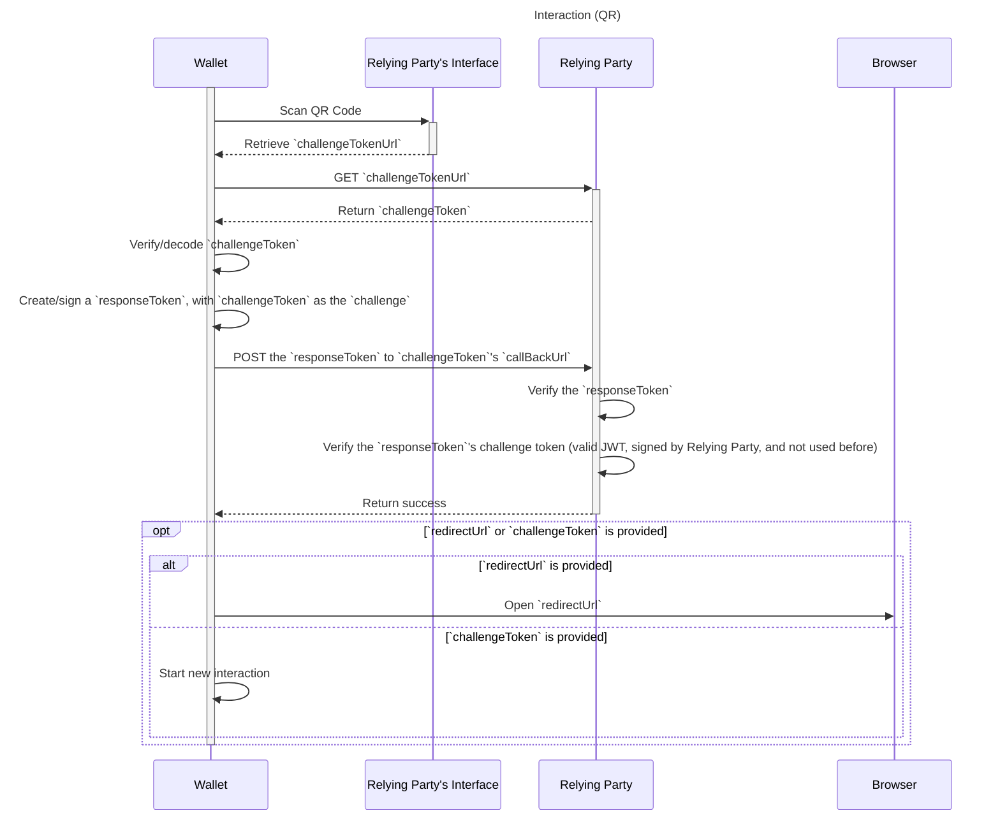
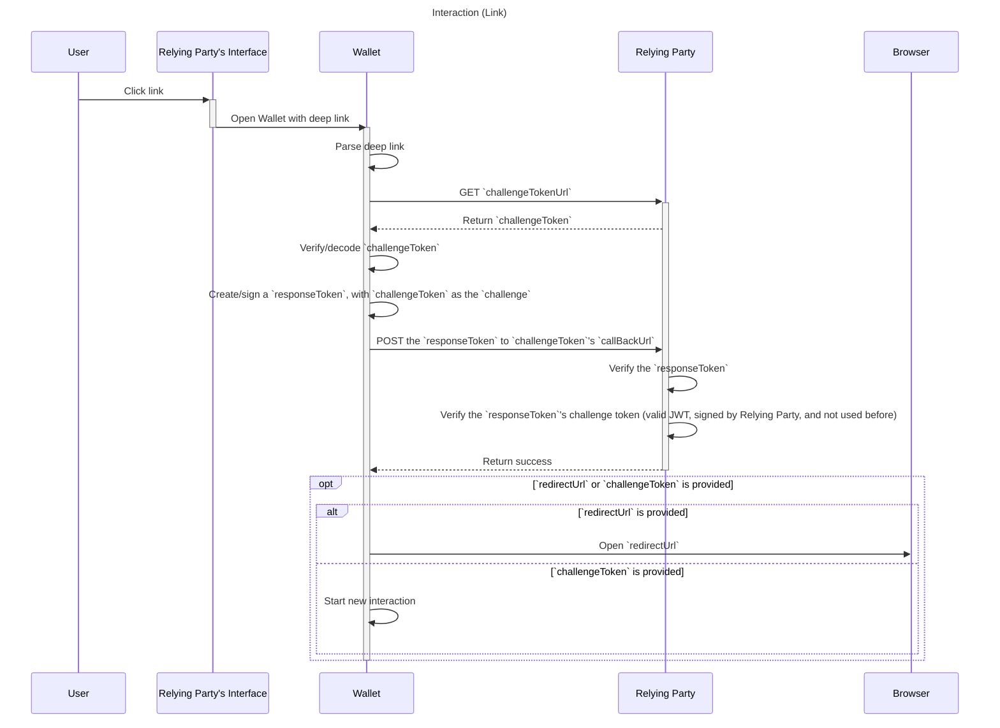
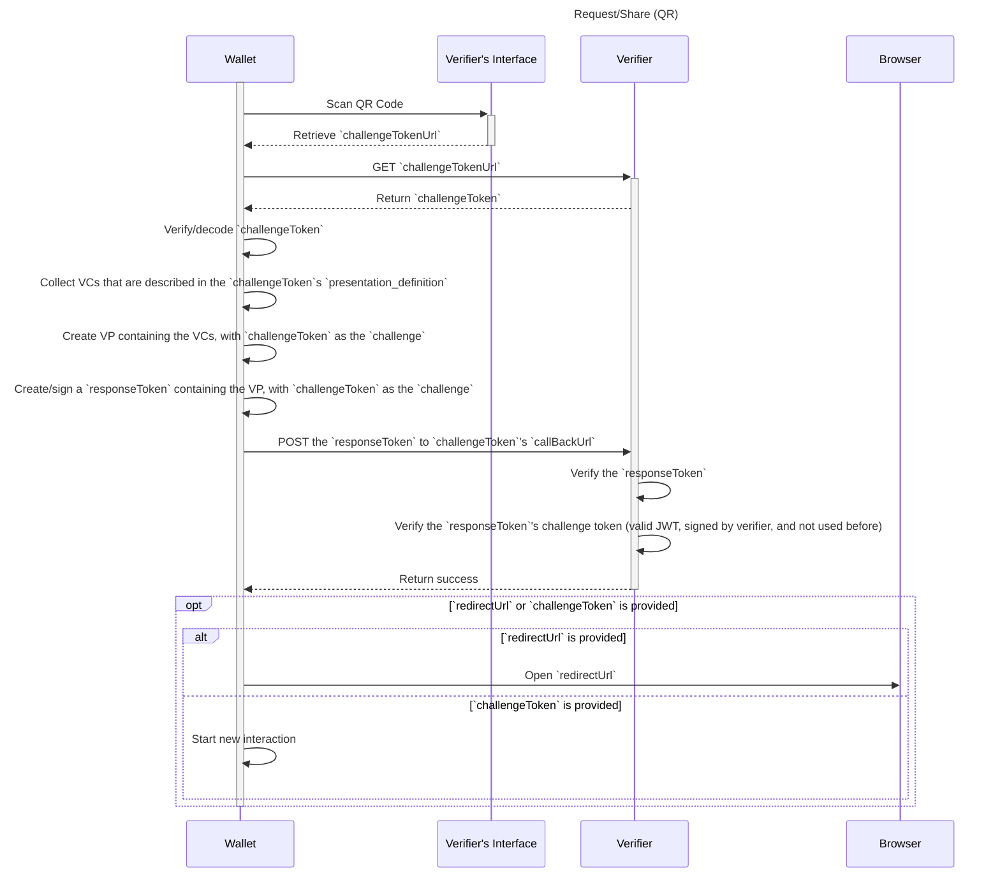
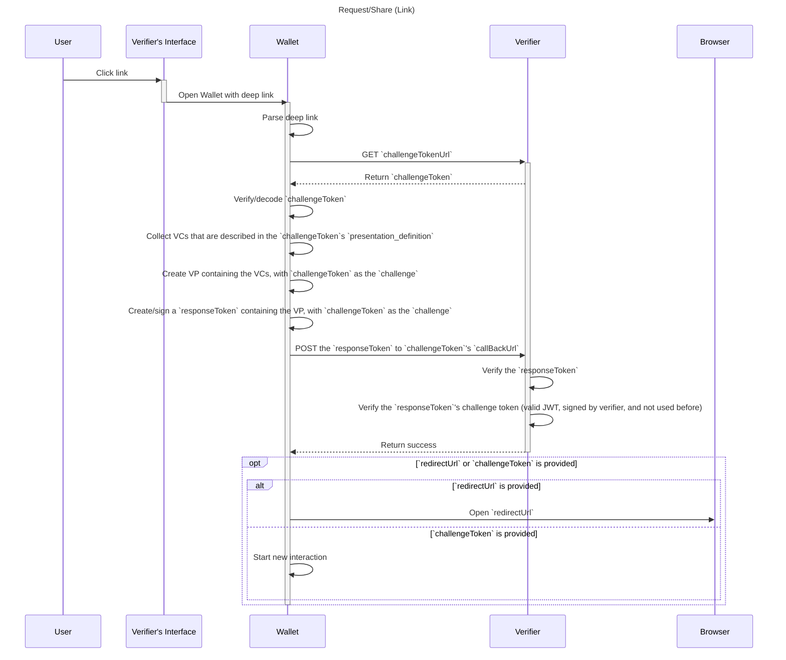

# Wallet And Credential Interactions

> WACI [__wak__-ee]

**Specification Status:** Draft

**Editors:**
~ [Afshan Aman](https://www.linkedin.com/in/afshan-aman/) (Bloom)
~ [Eddie Hedges](https://www.linkedin.com/in/eddiehedges/) (Bloom)

**Contributors:**
~ [Jace Hensley](https://www.linkedin.com/in/jacehensley/) (Bloom)

**Participate:**
~ [GitHub repo](https://github.com/hellobloom/wallet-and-credential-interactions)
~ [File a bug](https://github.com/hellobloom/wallet-and-credential-interactions/issues)
~ [Commit history](https://github.com/hellobloom/wallet-and-credential-interactions/commits/master)

---

## Abstract

There are interactions between a wallet and relying party that require passing
information between the two. WACI provides a standard for these interactions.

WACI v0.1 incorporates elements from a number of existing specifications and
protocols. It inherits its overall structure from a
[previous version of WACI](https://github.com/decentralized-identity/wallet-and-credential-interactions),
but makes use of
[DIDComm v2.0](https://github.com/decentralized-identity/didcomm-messaging)
communication protocols, along with
[Aries Present Proof](https://github.com/hyperledger/aries-rfcs/blob/master/features/0454-present-proof-v2/README.md)
message formats and
[DIF Presentation Exchange](https://identity.foundation/presentation-exchange/)
data objects.

It is anticipated that future versions of this specification will add
support for additional messaging, transport, or other mechanisms beyond those
used in v0.1.

## Status of This Document

WACI is a draft specification under development by [DIF Claims and Credentials WG](https://identity.foundation/working-groups/claims-credentials.html)

## Interactions

All interactions use the same common blocks:

### QR Code or Link

Two ways of initiating an interaction is for the relying party to display either
a QR code or a link to the user. There could be other ways to initiate an
interaction but this document will be discussing QR codes and links.

If the user is using an app/webiste on something other than the device that
their wallet is on, then they would be able to scan a QR code with the wallet.
_But_ if the user is using the device that also has their wallet then they
wouldn't be able to scan a QR code, they would need to be able to click a link
that will open their mobile wallet.

There are of course other use cases where you might need one over the other or
both. For example, in an email you may want to display both a link and a QR code
because you won't be able to dynamically choose between the two.

### Payload

Some mediums do not allow for a large amount of data to be sent (e.g a QR code)
to support those cases the initial payload contains instructions for fetching
the challenge token.

This is payload can be displayed in a QR code or added to a link as a query
parameter.

<tab-panels selected-index="0">

<nav>
  <button type="button">QR</button>
  <button type="button">Link</button>
</nav>

<section>


</section>

<section>

<a target="_blank" rel="noopener noreferrer" href="https://deep-link-into-app.com/waci?payload=eyJjaGFsbGVuZ2VUb2tlblVybCI6Imh0dHBzOi8vZXhhbXBsZS5jb20vYXBpL2dldC10b2tlbi9mYjI4YjRlYy00MjA5LTRiNzgtODUwNy03Y2M0OTE2NGNiMzciLCJ2ZXJzaW9uIjoiMSJ9">Click Me!</a>

</section>

</tab-panels>

::: example QR/Link Payload

```json
{
  "challengeTokenUrl": "https://example.com/api/get-token/fb28b4ec-4209-4b78-8507-7cc49164cb37",
  "version": "1"
}
```

:::

- `challengeTokenUrl`:
  - MUST be unique to the interaction
  - MUST be a `GET` endpoint that returns the
  [Token Payload](#token-url-response)
- `version`:
  - This is the version of just the QR/link payload, not the rest of the
  interaction

### Token URL Response

The result from `GET`ing the provided `challengeTokenUrl`. This contains the
initial JWT that really starts the interaction.

::: example Token URL Response

```json
{
  "challengeToken": "{{JWT String}}"
}
```

:::

#### Challenge Token

::: example Challenge Token Header

```json
// Header
{
  "alg": "...",
  "kid": "did:example:ebfeb1f712ebc6f1c276e12ec21#primary"
}
```

:::

- MUST have `alg` and `kid`, so the JWT can be verified

::: example Challenge Token Payload

```json
// Payload
{
  "jti": "...",
  "iss": "did:example:ebfeb1f712ebc6f1c276e12ec21",
  "aud": "...",
  "callbackUrl": "https://example.com/api/callback-url",
  "purpose": "...",
  "version": "..."
}
```

:::

- MUST have `iss`
- MUST have `jti` to protect against replay attacks
- CAN have `aud` if the DID of the wallet is known
- MUST have `callbackUrl`
  - MUST be a `POST` endpoint to take the wallet's reponse (payload determined
  by the `purpose`)
- MUST have `purpose`
- MUST have `version`
  - This is specific to the `purpose`

### Callback URL

#### Request

Each interaction will `POST` data to the `callbackUrl`:

::: example Callback URL Request Payload

```json
{
  "responseToken": "{{Signed JWT}}",
  "from": "qr" | "link"
}
```

:::

- `responseToken`
  - A JWT signed by the user, will contain the `challengeToken`
- `from`
  - MUST be either "qr" or "link"
  - The issuer may need to handle things differently based on how the user is
  claiming the credentials

##### Response Token

The response token is signed by the user and acts as a way to prove ownership of
their DID and to pass additional data back to the relying party.

:::example Response Token Header

```json
{
  "alg": "...",
  "kid": "did:example:c276e12ec21ebfeb1f712ebc6f1#primary"
}
```

:::

- MUST have `alg` and `kid`, so the JWT can be verified

:::example Response Token Payload

```json
{
  "iss": "did:example:c276e12ec21ebfeb1f712ebc6f1",
  "aud": "did:example:ebfeb1f712ebc6f1c276e12ec21",
  "challenge": "{{CHALLENGE TOKEN}}"
}
```

:::

- MUST have `iss`
- MUST have `aud`
  - `aud` MUST be the `iss` of the challenge token
- MUST have `challenge`
  - `challenge` MUST be the challenge token given by the issuer

#### Reponse

The `POST` to the provided `callbackUrl` can return with a simple successful
HTTP response or it can return a success with follow up details. A
`redirectLink` that the app will open in a browser or `challengeToken` that will
start a new interaction.

::: example Response Redirect Payload

```json
{
  "redirectUrl": "https://example.com/redirect-url?id={{Some id that identifies the user}}"
}
```

:::

This could be used to show a success message or bring them back to the
website/app to continue where they left off. Most of the time `redirectUrl` will
only be used when the user is already using their phone (see
[above](#qr-code-or-link)).

**OR**

::: example Response Chain Payload

```json
{
  "challengeToken": "{{JWT String}}"
}
```

:::

This could be used to follow up a request interaction with an offer interaction,
or even a chain of request interactions that are based on the previously shared
VCs.

### Token Storage

Because the challenge token is always sent back to the relying party, the token
doesn't need to be stored on creation. And this allows the relying party to not
have to worry about someone spamming their API and driving up their storage
costs.

But no storage at all can lead to replay attacks. One suggested way to mitigate
replay attacks while keeping storage to a minimum is to only store the hash of
"used" tokens and have a cron job that cleans this storage based on expiration
date of the tokens.

### Swimlane

Each interaction will be slightly different but will follow this general pattern:

<tab-panels selected-index="0">

<nav>
  <button type="button">QR Based</button>
  <button type="button">Link Based</button>
</nav>

<section>



</section>

<section>



</section>

</tab-panels>

## Request/Share

The request/share interaction is for the use case where an verifier wants a user
to share credential(s) with them.

### Challenge Token

An example of a `request` challenge token has the following properties (in
addition to the base [properties](#challenge-token)):

:::example Request Challenge Token Header

```json
// Header
{
  "alg": "...",
  "kid": "did:example:ebfeb1f712ebc6f1c276e12ec21#primary"
}
```

:::

:::example Request Challenge Token Payload

```json
// Payload
{
  "jti": "...",
  "iss": "did:example:ebfeb1f712ebc6f1c276e12ec21",
  "aud": "...",
  "callbackUrl": "https://example.com/api/callback-url",
  "purpose": "request",
  "version": "0.1",
  "presentation_definition": {
    // ...
  }
}
```

:::

- `purpose` MUST be `"request"`
- MUST have `presentation_definition`
  - Uses [Presentation Exchange](https://identity.foundation/presentation-exchange/)
  to define the requirements.

### Callback URL

#### Request

In addition to the standard [Callback URL Request](#request) payload, the
offer/claim flow adds `presentation`

:::example Request Callback URL Request Payload

```json
{
  "responseToken": "{{Signed JWT}}",
  "from": "qr" | "link"
}
```

:::

##### Response Token

In addition to the standard `responseToken` the offer/claim interaction adds
`verifiable_presentation` to the payload.

:::example Request Response Token Header

```json
// Header
{
  "alg": "...",
  "kid": "did:example:c276e12ec21ebfeb1f712ebc6f1#primary"
}
```

:::

:::example Request Response Token Payload

```json
// Paylaod
{
  "iss": "did:example:c276e12ec21ebfeb1f712ebc6f1",
  "aud": "did:example:ebfeb1f712ebc6f1c276e12ec21",
  "challenge": "{{CHALLENGE TOKEN}}",
  "verifiable_presentation": {
    /* ... */
    "type": ["VerifiablePresentation", "PresentationSubmission"],
    "presentation_submission": {
      /* ... */
    }
    /* ... */
  }
}
```

:::

- MUST have `verifiable_presentation`
  - Using Presentation Exchange's
  [Presentation Submission](https://identity.foundation/presentation-exchange/#presentation-submission)
  - This `VerifiablePresentation` MUST be a `PresentationSubmission`
  - This `VerifiablePresentation`'s `proof.challenge` MUST be the challenge
  token given by the issuer

#### Response

The request/share flow does not add anything to the
[Callback URL Response](#response).

### Swimlane

<tab-panels selected-index="0">

<nav>
  <button type="button">QR Based</button>
  <button type="button">Link Based</button>
</nav>

<section>



</section>

<section>



</section>

</tab-panels>

## DIDComm Messages

### Message 0 - Propose Presentation

::: todo Propose Presentation
See [#20](https://github.com/decentralized-identity/waci-presentation-exchange/issues/20)
:::

```
{
    "type": "https://didcomm.org/present-proof/3.0/propose-presentation",
    "id": "<message unique id>",
    "pthid": "<id present in invitation>",
    "from": "did:example:prover",
    "to": "did:example:verifier"
}
```

### Message 1 - Request Presentation

::: todo Request Presentation
See [#21](https://github.com/decentralized-identity/waci-presentation-exchange/issues/21)
:::

```
{
  "type": "https://didcomm.org/present-proof/3.0/request-presentation",
  "id": "0ac534c8-98ed-4fe3-8a41-3600775e1e92",
  "from": "did:example:verifier",
  "to": "did:example:prover",
  "body": {},
  "attachments": [
    {
      "@id": "ed7d9b1f-9eed-4bde-b81c-3aa7485cf947",
      "mime-type": "application/json",
      "format": "dif/presentation-exchange/definitions@v1.0",
      "data": {
        "json": {
          "dif": {
            "options": {
              "challenge": "3fa85f64-5717-4562-b3fc-2c963f66afa7",
              "domain": "4jt78h47fh47"
            },
            "presentation_definition": {
              "frame": {
                  "@context": [
                    "https://www.w3.org/2018/credentials/v1",
                    "https://w3id.org/vaccination/v1",
                    "https://w3id.org/security/suites/bls12381-2020/v1"
                  ],
                  "type": ["VerifiableCredential", "VaccinationCertificate"],
                  "credentialSubject": {
                    "@explicit": true,
                    "type": ["VaccinationEvent"],
                    "batchNumber": {},
                    "countryOfVaccination": {}
                  }
                },
                "input_descriptors": [
                  {
                    "id": "vaccination_input",
                    "name": "Vaccinatin Certificate",
                    "schema": "https://w3id.org/vaccination/#VaccinationCertificate",
                    "constraints": {
                      "fields": [
                        {
                          "path": ["$.credentialSubject.batchNumber"],
                          "filter": {
                            "type": "string"
                          }
                        },
                        {
                          "path": ["$.credentialSubject.countryOfVaccination"],
                          "filter": {
                            "type": "string"
                          }
                        }
                      ]
                    }
                  }
                ]
            }
          }
        }
      }
    }
  ]
}
```

### Message 2 - Present Proof

::: todo Present Proof
See [#22](https://github.com/decentralized-identity/waci-presentation-exchange/issues/22)
:::

```
{
  "type": "https://didcomm.org/present-proof/3.0/presentation",
  "id": "f1ca8245-ab2d-4d9c-8d7d-94bf310314ef",
  "from": "did:example:verifier",
  "to": "did:example:prover",
  "body": {},
  "attachments": [
    {
      "@id": "2a3f1c4c-623c-44e6-b159-179048c51260",
      "mime-type": "application/ld+json",
      "format": "dif/presentation-exchange/submission@v1.0",
      "data": {
        "@context": [
          "https://www.w3.org/2018/credentials/v1",
          "https://identity.foundation/presentation-exchange/submission/v1"
        ],
        "type": [
          "VerifiablePresentation",
          "PresentationSubmission"
        ],
        "holder": "did:example:123",
        "verifiableCredential": [
          {
            "@context": [
              "https://www.w3.org/2018/credentials/v1",
              "https://w3id.org/vaccination/v1",
              "https://w3id.org/security/bbs/v1"
            ],
            "id": "urn:uvci:af5vshde843jf831j128fj",
            "type": [
              "VaccinationCertificate",
              "VerifiableCredential"
            ],
            "description": "COVID-19 Vaccination Certificate",
            "name": "COVID-19 Vaccination Certificate",
            "expirationDate": "2029-12-03T12:19:52Z",
            "issuanceDate": "2019-12-03T12:19:52Z",
            "issuer": "did:example:456",
            "credentialSubject": {
              "id": "urn:bnid:_:c14n2",
              "type": "VaccinationEvent",
              "batchNumber": "1183738569",
              "countryOfVaccination": "NZ"
            },
            "proof": {
              "type": "BbsBlsSignatureProof2020",
              "created": "2021-02-18T23:04:28Z",
              "nonce": "JNGovx4GGoi341v/YCTcZq7aLWtBtz8UhoxEeCxZFevEGzfh94WUSg8Ly/q+2jLqzzY=",
              "proofPurpose": "assertionMethod",
              "proofValue": "AB0GQA//jbDwMgaIIJeqP3fRyMYi6WDGhk0JlGJc/sk4ycuYGmyN7CbO4bA7yhIW/YQbHEkOgeMy0QM+usBgZad8x5FRePxfo4v1dSzAbJwWjx87G9F1lAIRgijlD4sYni1LhSo6svptDUmIrCAOwS2raV3G02mVejbwltMOo4+cyKcGlj9CzfjCgCuS1SqAxveDiMKGAAAAdJJF1pO6hBUGkebu/SMmiFafVdLvFgpMFUFEHTvElUQhwNSp6vxJp6Rs7pOVc9zHqAAAAAI7TJuDCf7ramzTo+syb7Njf6ExD11UKNcChaeblzegRBIkg3HoWgwR0hhd4z4D5/obSjGPKpGuD+1DoyTZhC/wqOjUZ03J1EtryZrC+y1DD14b4+khQVLgOBJ9+uvshrGDbu8+7anGezOa+qWT0FopAAAAEG6p07ghODpi8DVeDQyPwMY/iu2Lh7x3JShWniQrewY2GbsACBYOPlkNNm/qSExPRMe2X7UPpdsxpUDwqbObye4EXfAabgKd9gCmj2PNdvcOQAi5rIuJSGa4Vj7AtKoW/2vpmboPoOu4IEM1YviupomCKOzhjEuOof2/y5Adfb8JUVidWqf9Ye/HtxnzTu0HbaXL7jbwsMNn5wYfZuzpmVQgEXss2KePMSkHcfScAQNglnI90YgugHGuU+/DQcfMoA0+JviFcJy13yERAueVuzrDemzc+wJaEuNDn8UiTjAdVhLcgnHqUai+4F6ONbCfH2B3ohB3hSiGB6C7hDnEyXFOO9BijCTHrxPv3yKWNkks+3JfY28m+3NO0e2tlyH71yDX0+F6U388/bvWod/u5s3MpaCibTZEYoAc4sm4jW03HFYMmvYBuWOY6rGGOgIrXxQjx98D0macJJR7Hkh7KJhMkwvtyI4MaTPJsdJGfv8I+RFROxtRM7RcFpa4J5wF/wQnpyorqchwo6xAOKYFqCqKvI9B6Y7Da7/0iOiWsjs8a4zDiYynfYavnz6SdxCMpHLgplEQlnntqCb8C3qly2s5Ko3PGWu4M8Dlfcn4TT8YenkJDJicA91nlLaE8TJbBgsvgyT+zlTsRSXlFzQc+3KfWoODKZIZqTBaRZMft3S/",
              "verificationMethod": "did:example:123#key-1"
            }
          }
        ],
        "presentation_submission": {
          "id": "1d257c50-454f-4c96-a273-c5368e01fe63",
          "definition_id": "32f54163-7166-48f1-93d8-ff217bdb0654",
          "descriptor_map": [
            {
              "id": "vaccination_input",
              "format": "ldp_vp",
              "path": "$.verifiableCredential[0]"
            }
          ]
        },
        "proof": {
          "type": "Ed25519Signature2018",
          "verificationMethod": "did:example:123#key-0",
          "created": "2021-05-14T20:16:29.565377",
          "proofPurpose": "authentication",
          "challenge": "3fa85f64-5717-4562-b3fc-2c963f66afa7",
          "jws": "eyJhbGciOiAiRWREU0EiLCAiYjY0IjogZmFsc2UsICJjcml0IjogWyJiNjQiXX0..7M9LwdJR1_SQayHIWVHF5eSSRhbVsrjQHKUrfRhRRrlbuKlggm8mm_4EI_kTPeBpalQWiGiyCb_0OWFPtn2wAQ"
        }
      }
    }
  ]
}
```

## Credential Manifest (Working Copy)

Because the
[Credential Manifest spec](https://identity.foundation/credential-manifest) is
just a strawman at the moment we will rely on a "frozen" copy of the spec
outlined below. The WACI spec will not be considered stable until the Credential
Manifest spec is, but we want to be able to implement early prototypes against
something so we need a version of the spec to base it off of.

This is the CM spec as of 02/22/2021.

Alterations in the spec are colored in <span style="color:darkgreen;">green</span>

</section>
