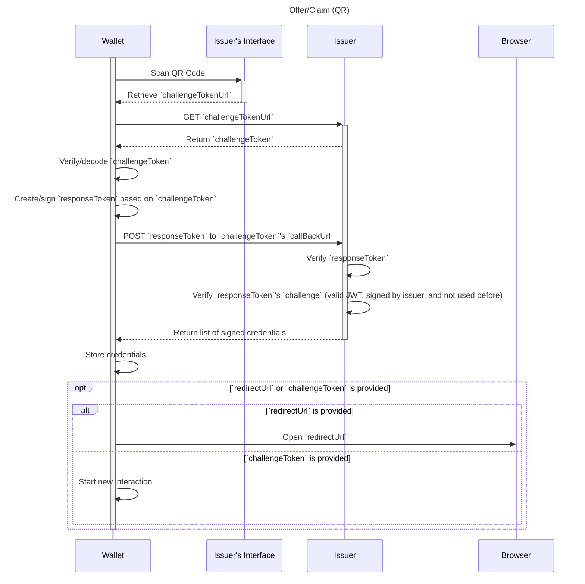
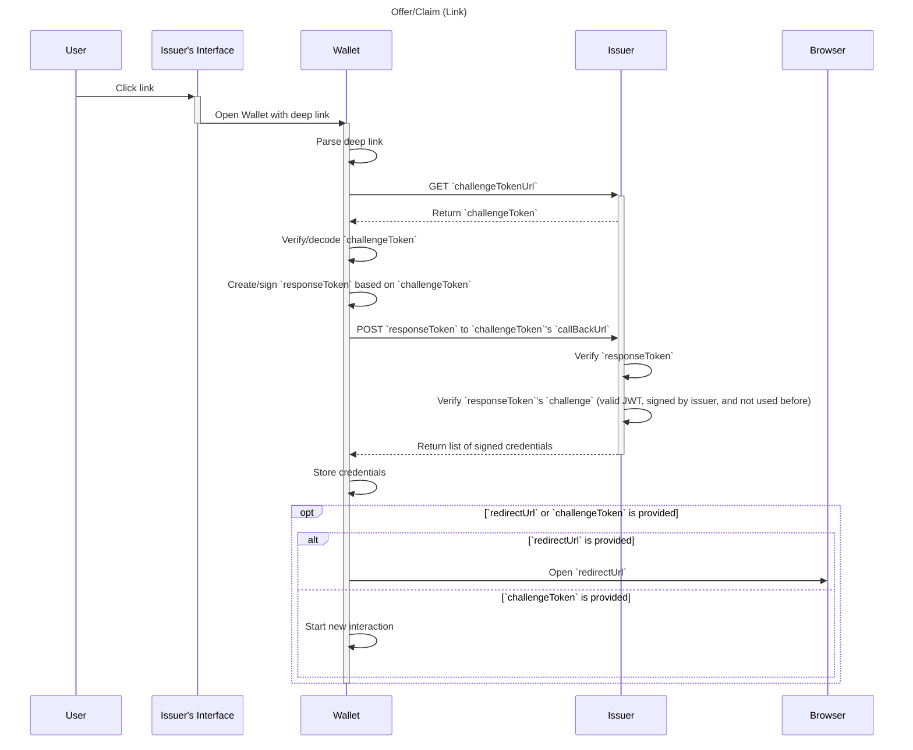
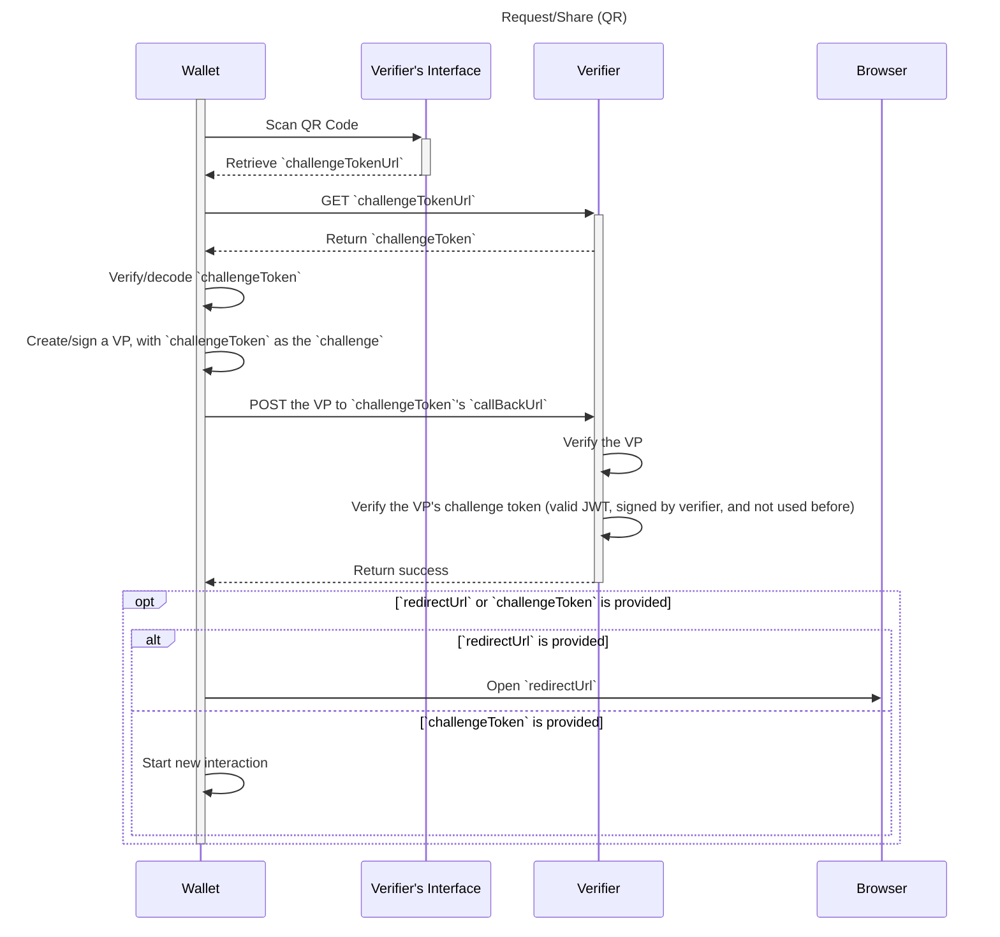
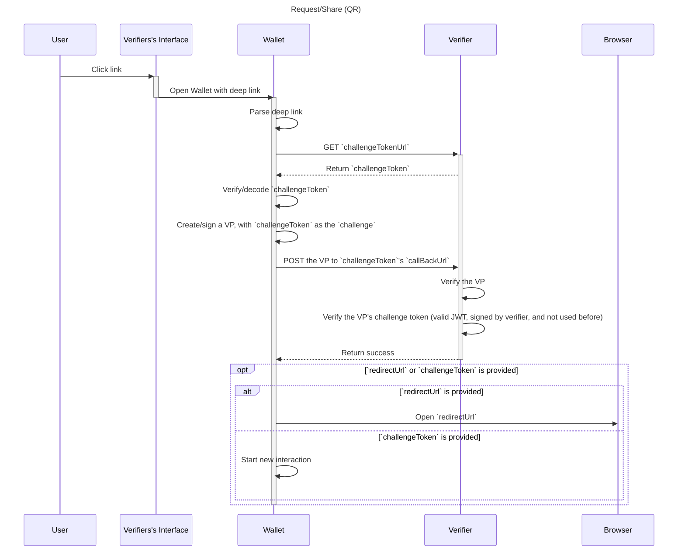

# Wallet Credential Interactions

> WACI [__wak__-ee]

**Specification Status:** Draft

**Editors:**
~ [Afshan Aman](https://www.linkedin.com/in/afshan-aman/) (Bloom)
~ [Eddie Hedges](https://www.linkedin.com/in/eddiehedges/) (Bloom)

**Contributors:**
~ [Jace Hensley](https://www.linkedin.com/in/jacehensley/) (Bloom)

**Participate:**
~ [GitHub repo](https://github.com/hellobloom/wallet-credential-interactions)
~ [File a bug](https://github.com/hellobloom/wallet-credential-interactions/issues)
~ [Commit history](https://github.com/hellobloom/wallet-credential-interactions/commits/master)

---

## Abstract

There are interactions between a wallet and relying party that require passing information between the two. WACI provides a standard for these interactions.

## Status of This Document

WACI is a draft specification under development by Bloom and Affinidi.

## QR Code Or Link

If the user is using an app/webiste on something other than the device that their wallet is on, then they would be able to scan a QR code with the wallet. _But_ if the user is using the device that also has their wallet then they wouldn't be able to scan a QR code, they would need to be able to click a link that will open their mobile wallet.

There are of course other use cases where you might need one over the other or both. For example, in an email you may want to display both a link and a QR code because you won't be able to dynamically choose between the two.

## Token Storage

Because the challenge token is always sent back to the relying party, the token doesn't need to be stored on creation. And this allows the relying party to not have to worry about someone spamming their API and driving up their storage costs.

But no storage at all can lead to replay attacks. One suggested way to mitigate replay attacks while keeping storage to a minimal is to only store the hash of "used" tokens and have a cron job that cleans this storage based on expiration date of the tokens.

## Interactions

All interactions use the same common blocks:

### Payload

This is the payload that is displayed in a QR code or added as a query param to a link.

```json
{
  "challengeTokenUrl": "https://example.com/api/get-token/fb28b4ec-4209-4b78-8507-7cc49164cb37",
  "version": "..."
}
```

- `challengeTokenUrl`:
  - MUST be unique to the interaction
  - MUST be a `GET` endpoint that returns the [Token Payload](#token-url-response)
- `version`:
  - This is the version of just the QR/link payload, not the rest of the interaction

### Token URL Response

The result from `GET`ing the provided `challengeTokenUrl`. This contains the initial JWT that really starts the interaction.

```json
{
  "challengeToken": "{{JWT String}}"
}
```

#### Challenge Token

```json
{
  "header": {
    "alg": "...",
    "kid": "did:example:ebfeb1f712ebc6f1c276e12ec21#primary"
  },
  "payload": {
    "jti": "...",
    "iss": "did:example:ebfeb1f712ebc6f1c276e12ec21",
    "aud": "...",
    "callbackUrl": "https://example.com/api/callback-url",
    "purpose": "...",
    "version": "..."
  }
}
```

- `header`
  - MUST have `alg` and `kid`, so the JWT can be verified
- `payload`
  - MUST have `iss`
  - MUST have `jti` to protect against replay attacks
  - CAN have `aud` if the DID of the wallet is known
  - MUST have `callbackUrl`
    - MUST be a `POST` endpoint to take the wallet's reponse (determined by the `purpose`)
  - MUST have `purpose`
    - See [Purpose](#purpose) below
  - MUST have `version`
    - This is specific to the `purpose`

### Callback URL

#### Request

Each interaction will `POST` specific data to the `callbackUrl`. But all `POST`s to the `callbackUrl` will include the following:

```json
{
  "from": "qr" | "link"
}
```

- `from`
  - MUST be either "qr" or "link"
  - The issuer may need to handle things differently based on how the user is claiming the credentials

#### Reponse

The `POST` to the provided `callbackUrl` can return with a simple successful HTTP response or it can return a success with follow up details. A `redirectLink` that the app will open in a browser or `challengeToken` that will start a new interaction.

```json
{
  "redirectUrl": "https://example.com/redirect-url?id={{Some id that identifies the user}}"
}
```

This could be used to show a success message or bring them back to the website/app to continue where they left off. Most of the time `redirectUrl` will only be used when the user is already using their phone (see [above](#qr-code-or-link)).

**OR**

```json
{
  "challengeToken": "{{JWT String}}"
}
```

This could be used to follow up a request interaction with an offer interaction, or even a chain of request interactions that are based on the previously shared VCs.

## Offer/Claim

The offer/claim interaction is for the use case where an issuer wants to give credential(s) to the user.

### Challenge Token

An example of an `offer` challenge token has the following properties (in addition to the base [properties](#challenge-token)):

```json
{
  "header": {
    "alg": "...",
    "kid": "did:example:ebfeb1f712ebc6f1c276e12ec21#primary"
  },
  "payload": {
    "jti": "...",
    "iss": "did:example:ebfeb1f712ebc6f1c276e12ec21",
    "aud": "...",
    "callbackUrl": "https://example.com/api/callback-url",
    "purpose": "offer",
    /* Using [Credential Manifest](https://identity.foundation/credential-manifest/) to define the available credentials */
    "credential_manifest": {
      "issuer": {
        /* ... */
      },
      "credential": {
        /* ... */
      },
      "presentation_definition": {
        /* ... */
      }
    }
  }
}
```

- `payload`
  - `purpose` MUST be `"offer"`
  - MUST have `credential_manifest`
    - If the `credential_manifest` provides a `presentation_definition` the response MUST include a `verifiable_presentation`

### Callback URL

#### Request

In addition to the standard [Callback URL Request](#request) payload, the offer/claim flow adds `responseToken`

```json
{
  responseToken: "{{Signed JWT}}"
  from: "qr" | "link"
}
```

##### Response Token

The response token is signed by the user and acts as a way to prove ownership of their DID as well as accept the credentials they are offered.

```json
{
  "header": {
    "alg": "...",
    "kid": "did:example:c276e12ec21ebfeb1f712ebc6f1#primary"
  },
  "payload": {
    "iss": "did:example:c276e12ec21ebfeb1f712ebc6f1",
    "aud": "did:example:ebfeb1f712ebc6f1c276e12ec21",
    "challenge": "{{CHALLENGE TOKEN}}",
    "verifiable_presentation": {
      /* ... */
      "type": [
        "VerifiablePresentation",
        "PresentationSubmission"
      ],
      "presentation_submission": {
        /* Using Presentation Exchange's [Presentation Submission](https://identity.foundation/presentation-exchange/#presentation-submission) */
        /* ... */
      }
      /* ... */
    }
  }
}
```

- `header`
  - MUST have `alg` and `kid`, so the JWT can be verified
- `payload`
  - MUST have `iss`
  - MUST have `aud`
    - `aud` MUST be the `iss` of the challenge token
  - MUST have `challenge`
    - `challenge` MUST be the challenge token given by the issuer
  - MUST have `verifiable_presentation` IF the challenge token provides a `presentation_definition`
    - This `VerifiablePresentation`  MUST be a `PresentationSubmission`

#### Response

In addition to the standard [Callback URL Response](#response) payload, the offer/claim flow adds `credentials`:

```json
{
  "credentials": [
    {
      "type": ["VerifiableCredential" /* ... */]
      // ...
    }
  ]
}
```

**OR**

```json
{
  "credentials": [
    {
      "type": ["VerifiableCredential" /* ... */]
      // ...
    }
  ],
  "redirectUrl": "https://example.com/redirect-url?id={{Some id that identifies the user}}"
}
```

**OR**

```json
{
  "credentials": [
    {
      "type": ["VerifiableCredential" /* ... */]
      // ...
    }
  ],
  "challengeToken": "{{JWT String}}"
}
```

- `credentials` MUST be an array of Verifiable Credentials issued to the user.

### Swimlane

<tab-panels selected-index="0">

<nav>
  <button type="button">QR Based</button>
  <button type="button">Link Based</button>
</nav>

<section>



</section>

<section>



</section>

</tab-panels>

## Request/Share

The request/share interaction is for the use case where an verifier wants a user to share credential(s) with them.

### Challenge Token

An example of a `request` challenge token has the following properties (in addition to the base [properties](#challenge-token-1)):

```json
{
  "header": {
    "alg": "...",
    "kid": "did:example:ebfeb1f712ebc6f1c276e12ec21#primary"
  },
  "payload": {
    "jti": "...",
    "iss": "did:example:ebfeb1f712ebc6f1c276e12ec21",
    "aud": "...",
    "callbackUrl": "https://example.com/api/callback-url",
    "purpose": "request",
    /* Using [Presentation Exchange](https://identity.foundation/presentation-exchange/) to define the requirements */
    "presentation_definition": {
      // ...
    }
  }
}
```

- `payload`
  - `purpose` MUST be `"request"`
  - MUST have `presentation_definition`

### Callback URL

#### Request

In addition to the standard [Callback URL Request](#request) payload, the offer/claim flow adds `presentation`

```json
{
  "presentation": {
    "type": ["VerifiablePresentation" /* ... */],
    "proof": {
      "challenge": "{{CHALLENGE TOKEN}}"
      // ...
    }
    // ...
  },
  "from": "qr" | "link"
}
```

- `presentation`:
  - MUST be a valid Verifiable Presentation
  - Have it's `proof.challenge` set to the challenge token given by the verifier

#### Response

The request/share flow does not add anything to the [Callback URL Response](#response).

### Swimlane

<tab-panels selected-index="0">

<nav>
  <button type="button">QR Based</button>
  <button type="button">Link Based</button>
</nav>

<section>



</section>

<section>



</section>

</tab-panels>
