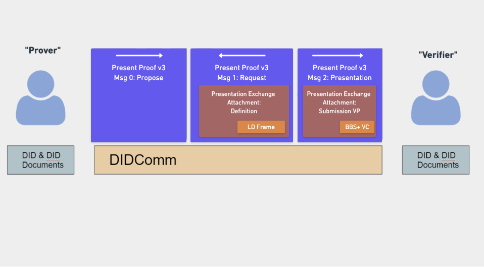
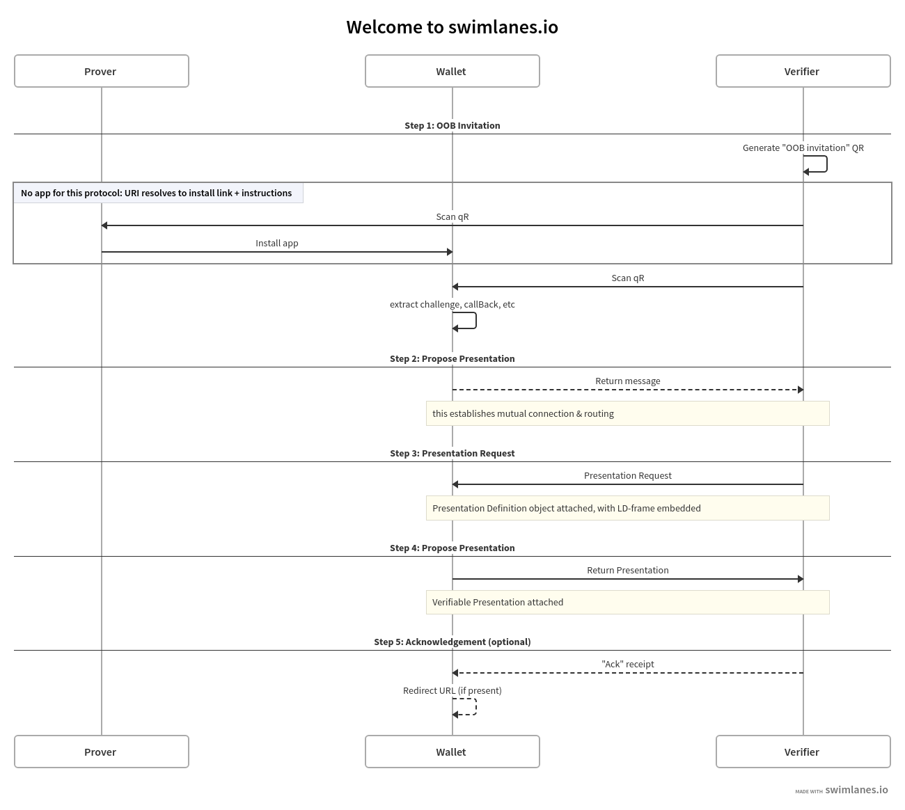
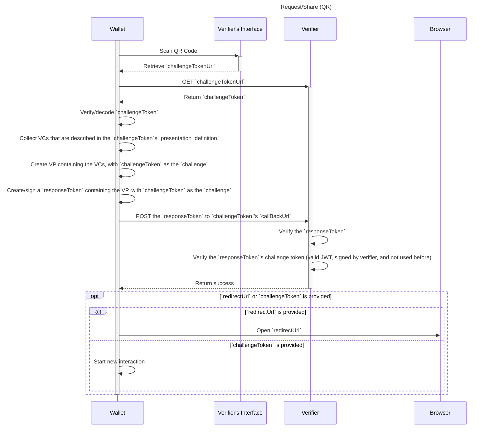

# Wallet And Credential Interactions

> WACI [__wak__-ee]

**Specification Status:** Draft

**Editors:**
~ [Orie Steele](https://www.linkedin.com/in/or13b/) (Transmute)
~ [Brent Zundel](https://www.linkedin.com/in/bzundel/) (Evernym)

**Authors:**
~ [Afshan Aman](https://www.linkedin.com/in/afshan-aman/) (Bloom)
~ [Eddie Hedges](https://www.linkedin.com/in/eddiehedges/) (Bloom)
~ [Jace Hensley](https://www.linkedin.com/in/jacehensley/) (Bloom)

**Participate:**
~ [GitHub repo](https://github.com/decentralized-identity/waci-presentation-exchange)
~ [File a bug](https://github.com/decentralized-identity/waci-presentation-exchange/issues)
~ [Commit history](https://github.com/decentralized-identity/waci-presentation-exchange/commits/master)

---

## Abstract

There are interactions between a wallet and relying party that require passing
information between the two. This specification provides an initial protocol
definition for these interactions. 

This document describes an interoperability profile which incorporates elements
from a number of existing specifications and protocols, without assuming or
requiring an implementer to understand all of them. It inherits its overall
structure from 
[the current pre-draft of WACI](https://github.com/decentralized-identity/wallet-and-credential-interactions),
but makes use of elements from the
[DIDComm v2.0](https://github.com/decentralized-identity/didcomm-messaging)
messaging protocol, along with
[Aries Present Proof](https://github.com/hyperledger/aries-rfcs/blob/master/features/0454-present-proof-v2/README.md)
message formats and
[DIF Presentation Exchange](https://identity.foundation/presentation-exchange/spec/v1.0.0/)
data objects. This version of the specification also restricts itself to
[Verifiable Credentials](https://www.w3.org/TR/vc-data-model/) which make use of
[BBS+ LD-Signatures](https://w3c-ccg.github.io/ldp-bbs2020).

It is anticipated that future versions of this specification will add
support for a much broader range of messaging and data-sharing formats than
those used in v0.1.

## Status of This Document

WACI v0.1 is a _PRE-DRAFT_ specification under development by the
[DIF Claims and Credentials Working Group](https://identity.foundation/working-groups/claims-credentials.html).

We encourage reviewers to submit issues on
[GitHub](https://github.com/decentralized-identity/waci-presentation-exchange/issues).

## Introduction

The 32nd Internet Identity Workshop (IIW) hosted a series of sessions about
designing an interoperable protocol for requesting and providing verifiable
information. The sessions lasted many hours over the course of several days and
resulted in interest among the participants in continuing to work out the
details of such a protocol, as well as a rough consensus around a set of
components that could be used in a layered approach for the design. The Claims
and Credentials Working Group at DIF agreed to host a work item for continuing
to work out the details. We outline some of the reasons for choosing each of the
components below. 



### Verifiable Presentations
The starting point for most participants in determining which components to
select was the
[Verifiable Credentials Data Model]((https://www.w3.org/TR/vc-data-model/)). It
describes a `Verifiable Presentation` object that is designed for sharing
information from `Verifiable Credentials`. 

### BBS+ LD-Signatures
Though a [number of signature types](https://www.lfph.io/wp-content/uploads/2021/02/Verifiable-Credentials-Flavors-Explained.pdf)
are used with `Verifiable Credentials`, many in the community seem to be
converging on [BBS+ LD-Signatures](https://w3c-ccg.github.io/ldp-bbs2020). The
reasons for this convergence are more fully described
[elsewhere](https://www.evernym.com/blog/bbs-verifiable-credentials/), but the
summary is that they bridge the two primary concerns of `Verifiable Credential`
implementers: ease of use and user privacy.

### Presentation Exchange
The next component is a data model that provides a solution to the problem of
how to format a request that verifiable information be presented. The
[Presentation Exchange specification](https://identity.foundation/presentation-exchange/spec/v1.0.0/)
was recently published by the Decentralized Identity Foundation. It defines a
`Presentation Definition` data object which may be used by a relying party to
request information, and a `Presentation Submission` object which describes the
relationship between the `Presentation Definition` and the submitted verifiable
information.

Since
[Presentation Exchange](https://identity.foundation/presentation-exchange/spec/v1.0.0/)
supports the use of `Verifiable Presentations` as a response to a `Presentation
Definition`, while remaining agnostic to transport protocols, it is ideal for
our purposes.

### Communication, Transport, and Protocol
Previously described components were, for the most part, agreed upon readily.
The bulk of the conversations at IIW centered around communication and protocol
options and sought to answer the following questions:
- "How should the data objects be communicated from one party to another?"
- "How ought they to be transported securely?"
- "What protocol could be used for the exchange?"

#### DIDComm
Before participants settled on using elements of
[DIDComm v2.0](https://identity.foundation/didcomm-messaging/spec/) to securely
communicate the data objects, there was a long and lively discussion about other
options. 

[CHAPI](https://w3c-ccg.github.io/credential-handler-api/) is an API for
exchanging data between websites and browsers. It was seen as too limited to a
particular technology to be widely useful for wallet applications on smart
phones and other devices without significant changes.

[VC-HTTP-API](https://w3c-ccg.github.io/vc-http-api/) was seen as promising, but
in its current state lacks an API for a `Verifiable Credential` holder. A number
of participants expressed a desire for the WACI specification to strive to be
compatible with this API, and that remains a goal of this group.

[DIDComm v2.0](https://identity.foundation/didcomm-messaging/spec/) describes
a method for securely communicating authenticated messages between entities that
control [Decentralized Identifiers](https://www.w3.org/TR/did-core/) along any
transport layer. It allows for two parties to mutually authenticate and securely
communicate. DIDComm has a large community interested in using it, and many have
already implemented DIDComm v1.0. 

#### Aries Present Proof

[OIDC-SIOP](https://openid.bitbucket.io/connect/openid-connect-self-issued-v2-1_0.html)
seeks to bridge existing federated identity capabilities on the internet with
principles of self-sovereign identity, and may ultimately be a good fit for this
protocol. It was not selected for this version of the specification primarily
because v1 of the specification has been deprecated, and v2 of the specification
is being incorporated into the next major version of OIDC, so it is not yet
ready.

[Aries Protocols](https://github.com/hyperledger/aries-rfcs), specifically the
[present proof protocol](https://github.com/hyperledger/aries-rfcs/tree/master/features/0454-present-proof-v2)
were explored as a possible option. The group determined that the protocol's
existing support for DIDComm and Presentation Exchange, along with its use
within different implementations by a number of organizations made it an ideal
choice for this first iteration. 

### WACI
The [WACI](https://github.com/decentralized-identity/wallet-and-credential-interactions)
specification provides a framework within which the components above reside. It
was presented separately at IIW and almost immediately became a cornerstone of
this effort.

## Presentation Exchange Context
Presentation Exchange objects support a large variety of possible content and
signature types. As this version of our specification has a limited scope, a
number of considerations need to be made for
[presentation definitions](https://identity.foundation/presentation-exchange/#presentation-definition)
to provide what we need.

### format property

A `presentation definition` that complies with this specification MUST contain a
`format` property. The value of the `format` property MUST be an object with the
following property:
- `ldp_vp`: This property indicates that a W3C Verifiable Presentation will be
submitted in the form of a JSON object. The value of this property MUST be an
object with a `proof_type` property that has a value of either
`BbsBlsSignature2020`, `JsonWebSignature2020`, or `Ed25519Signature2018`.

For example:
```json5
{
  "presentation_definition": {
    "id": "32f54163-7166-48f1-93d8-ff217bdb0653",
    "input_descriptors": [],
    "format": {
      "ldp_vp": {
        "proof_type": ["BbsBlsSignature2020", "JsonWebSignature2020", "Ed25519Signature2018"]
      }
    }
  }
}
```

To allow for selective disclosure of Verifiable Credential claims the use of a 
`BbsBlsSignature2020` or `BbsBlsBoundSignature2020` is required for the
credential. These signatures allows for a zero knowledge proof of the original 
signature, allowing the prover to derive a corresponding
`BbsBlsSignatureProof2020` or `BbsBlsBoundSignatureProof2020` that will verify
the disclosed claims. `BbsBlsBoundSignature2020` and
`BbsBlsBoundSignatureProof2020` also provide a mechanism for privately binding
credentials and presentations to the holder. 

### frame property

In order to support selective disclosure of Verifiable Credential claims the use
of a JSON-LD frame object is combined with the above signature types.

The method for a verifier to provide a JSON-LD frame is to add a `frame`
property to the `presentation definition` object. The value of the `frame`
property MUST be a
[JSON-LD frame](https://json-ld.org/spec/FCGS/json-ld-framing/20180607/#framing)
for an object that complies with the [W3C VC Data Model](https://www.w3.org/TR/vc-data-model/).

For Example:
```json5
{
  "presentation_definition": {
    "id": "32f54163-7166-48f1-93d8-ff217bdb0653",
    "input_descriptors": [],
    "frame": {
      "@context": [
        "https://www.w3.org/2018/credentials/v1",
        "https://w3id.org/vaccination/v1",
        "https://w3id.org/security/suites/bls12381-2020/v1"
      ],
      "type": [
        "VerifiableCredential",
        "VaccinationCertificate"
      ],
      "credentialSubject": {
        "@explicit": true,
        "type": [
          "VaccinationEvent"
        ],
        "batchNumber": {},
        "countryOfVaccination": {}
      }
    }
  }
}
```
      ::: note
      It is important that the JSON-LD frame object be compatible with the input
      descriptors of the presentation definition. There is an assumed direct
      mapping between the JSON-LD frame object and the corresponding input
      descriptor object in the presentation definition.
      If a presentation definition has a JSON-LD frame that is inconsistent with
      the input descriptors, it may be impossible to produce an acceptable
      verifiable presentation for it.
      
      We anticipate that it may be possible to deterministically derive a valid
      JSON-LD frame from an input descriptor, but a formal specification for
      doing so does not, at this time, exist.
      :::

The Presentation Exchange specification does not currently define a `frame`
property for a `presentation definition`. This means that implementers of
Presentation Exchange who wish to use the protocol described here may run into
errors when using the 
[JSON Schema from Presentation Exchange](https://identity.foundation/presentation-exchange/spec/v1.0.0/#json-schema-2)
to validate `presentation definition` objects that contain a frame property.

We recommend using the following JSON Schema definition to validate
`presentation definition` objects that include a `frame` property:
```json
[[insert: ../test/presentation-definition/schema.json]]
```

More information about how frames work with BBS+ signatures can be found in the
[Linked Data Proof BBS+ Signatures 2020 Suite](https://w3c-ccg.github.io/ldp-bbs2020/#the-bbs-signature-proof-suite-2020)
and the [Mattr example implementation](https://github.com/mattrglobal/jsonld-signatures-bbs).

For a more general overview of LD-Framing strategies as a general approach to
querying and matching Linked-Data, see the
[JSON-LD Framing](https://json-ld.org/spec/FCGS/json-ld-framing/20180607/#framing)
guide written by the JSON-LD Community Group at W3C on the occasion of version
1.1 of the JSON-LD specification.

## DIDComm Context

The exchange specified in the [DIDComm v2
specification](https://identity.foundation/didcomm-messaging/spec/) is presumed
to take place between two subjects that control DIDs with certain properties,
and can take place over many different transports. Having a connection means
that each party in the relationship has a DID for the other parties, and parties
can communicate securely using the keys and endpoints within each DID Document. 

All parties MUST have a `DID document` that complies with this specification. 

### service property

A `DID document` that complies with this specification MUST have a `service`
property.

For example:

```json
{
  "service": [{
    "id": "did:example:123123123#someid",
    "type": "DIDCommMessaging",
    "serviceEndpoint": "https://example.com/endpoint",
    "routingKeys": ["did:example:somemediator#somekey"]
  }]
}
```
 
The value of the `service` property MUST be an array of objects composed as
follows:
- a service object MUST have an `id` property and its value MUST be a string
consisting of a unique identifier.
- a service object MUST have a `type` property and its value MUST be the
string `DIDCommMessaging`.
- a service object MUST have a `serviceEndpoint` property, and its value MUST
be a string consisting of a valid, resolvable URI.
- a service object MAY have a `routingKeys` property. If present its value MUST
be an array of strings. Each string MUST be a URI designating a valid routing
key. See below for more details.

#### Routing Keys

Routing Keys are used to enable message routing to agents unable to provide a
direct service endpoint. Routing is arranged by the message recipient and
communicated by the `service` property as defined above. 

Before preparing a routed message, the sender creates an encrypted package by
encrypting the message for the recipient. Then, for each routing key in the
`routingKeys` array in order, take the encrypted package, wrap it in a forward
message (see below), and encrypt the forward message to the routing key to
create a new encrypted package.

The process of wrapping the encrypted package in a forward message and
encrypting it is repeated for each routing key in the array. The final encrypted
package is transmitted to the listed `serviceEndpoint`.

Forward message structure:

```json5
{
    "type": "https://didcomm.org/routing/2.0/forward",
    "to": ["did:example:somemediator#somekey"], //the routing key URI
    "body":{
        "next": "did:example:123123123", //the recipient of the encrypted package
    },
    "attachments": [
        {
            "media_type": "application/didcomm-encrypted+json",
            "data": {
            	"json": { } //json structure of the encrypted package
        	}
        }
    ]
}
```

### Encryption

Messages are sent encrypted. Each message described in this specification MUST
be encrypted before transmission with the exception of the [message encoded into
a QR code](#step-1---generate-qr-code).

JOSE Header:

```json5
 {
    "typ":"JWM",
    "enc":"A256GCM"
   }
```

The `kid` used in the JWE recipients block MUST be the DID of the message
recipient.

The plaintext message to be encrypted is prepared by serializing the JSON to a
string and removing the whitespace.

The encrypted message MUST be in JSON form. Compact JWEs are not supported.

Further details on JWE creation may be found in
[RFC 7516](https://datatracker.ietf.org/doc/html/rfc7516).

Encoded message example, with abbreviations and line breaks for clarity:

```json5
{
     "protected": "eyJ0eXAiOi...19",
     "recipients": [
       {
    	"header": {
    		"kid": "did:example:recipient#key-agreement-key-1"
		},
    	"encrypted_key": "J1Fs9JaD...PalQWWLg"
       }
     ],
     "iv": "u5kIzo0m_d2PjI4m",
     "ciphertext": "qGuFFoHy...wa1C3T0QBes",
     "tag": "doe...cduiw"
   }
```

### Establishing an HTTP(S) Connection

In order to establish a new connection, Simply exchange a new message between
parties. Knowing the DID of the other parties does not indicate any level of
trust.

Details of sending an encrypted message to a `serviceEndpoint` via HTTP:

- Messages are transported via HTTP POST.
- The MIME Type for the POST request is set to the corresponding media type
defined in [Media Types](https://identity.foundation/didcomm-messaging/spec/#media-types),
e.g., `application/didcomm-encrypted+json`.
- A successful message receipt MUST return a code in the 2xx HTTP Status Code
range. It is RECOMMENDED that a HTTP POST return a `202 Accepted` status code.
- POST requests are transmit only. Messages are sent from the code that
submitted the POST request.
- HTTP Redirects SHOULD be followed. Only Temporary Redirects (307) are
acceptable. Permanent endpoint relocation SHOULD be managed with a DID document
update.
- Using HTTPS with TLS 1.2 or greater with a forward secret cipher will provide
Perfect Forward Secrecy (PFS) on the transmission leg.


## WACI Protocol Context

The interactions, objects, and assumptions outlined in the WACI pre-draft
specification are the basis for the following.  Specifically, the profile
describes the
[Request/Share flow](https://identity.foundation/wallet-and-credential-interactions/#requestshare).

As an overview, see this flow diagram:

<tab-panels selected-index="0">

<nav>
  <button type="button">QR-Based WACI Profile</button>
  <button type="button">QR-based WACI flow for comparison</button>
</nav>
<section>

</section>
<section>



</section>


</tab-panels>

## Interoperability Profile 

### Step 1 - Generate QR Code

The QR code used to start a presentation is constructed by encoding a json based
message into a URI, then encoding that URI into a QR code.

#### JSON message

The contents of the QR code to be generated are described in the following JSON
block, which DIDComm v2 calls an "out of band invitation."

```json=
{
  "type": "https://didcomm.org/out-of-band/2.0/invitation",
  "id": "599f3638-b563-4937-9487-dfe55099d900",
  "from": "did:example:verifier",
  "body": {
      "goal_code": "streamlined-vp",
      "accept": ["didcomm/v2"]
  }
}
```

#### Encoding

To encode this message, remove all json whitespace and Base 64 URL encode. The
result should look like this, for the example above:

```
eyJ0eXBlIjoiaHR0cHM6Ly9kaWRjb21tLm9yZy9vdXQtb2YtYmFuZC8yLjAvaW52aXRhdGlvbiIsImlkIjoiNTk5ZjM2MzgtYjU2My00OTM3LTk0ODctZGZlNTUwOTlkOTAwIiwiZnJvbSI6ImRpZDpleGFtcGxlOnZlcmlmaWVyIiwiYm9keSI6eyJnb2FsX2NvZGUiOiJzdHJlYW1saW5lZC12cCIsImFjY2VwdCI6WyJkaWRjb21tL3YyIl19fQ==
```

Prepend this encoded string with a domain and path, and a query parameter of
`_oob` set to the encoded message. 

```
https://example.com/some/path?_oob=eyJ0eXBlIjoiaHR0cHM6Ly9kaWRjb21tLm9yZy9vdXQtb2YtYmFuZC8yLjAvaW52aXRhdGlvbiIsImlkIjoiNTk5ZjM2MzgtYjU2My00OTM3LTk0ODctZGZlNTUwOTlkOTAwIiwiZnJvbSI6ImRpZDpleGFtcGxlOnZlcmlmaWVyIiwiYm9keSI6eyJnb2FsX2NvZGUiOiJzdHJlYW1saW5lZC12cCIsImFjY2VwdCI6WyJkaWRjb21tL3YyIl19fQ==
```

#### QR Code generated 

Present as a link, or as a QR code.


#### QR Code scanning and processing

The URI, if loaded into a browser SHOULD display instructions on how to download
and use a mobile application. If scanned inside an app that understands this
protocol, the message SHOULD be extracted from the URI's `_oob` query parameter
and processed without resolving the URI. This behavior allows for a better
fallback user experience should a user encounter a QR code without having a
suitable app.

### Step 2 - Send Message Proposing Presentation

A "Propose Presentation" message, optional in many cases, is defined in [Aries
RFC
0454](https://github.com/hyperledger/aries-rfcs/tree/master/features/0454-present-proof-v2#messages)
and its Presentation Exchange "attachment" defined in [RFC
0510](https://github.com/hyperledger/aries-rfcs/blob/master/features/0510-dif-pres-exch-attach/README.md#propose-presentation-attachment-format).
It either initiates a Request/Share interaction or answers an earlier invitation
to do so. In the context of this flow, this response to the invitation
establishes the same kind of connection that the WACI specification establishes
in can be functionally equivalent to the two-step request for a challenge token
& callback URL described in the [challenge token
section](https://identity.foundation/wallet-and-credential-interactions/#challenge-token-3).

The response to the invite qR with presentation-proposal attached looks like this:

```json
{
    "type": "https://didcomm.org/present-proof/3.0/propose-presentation",
    "id": "95e63a5f-73e1-46ac-b269-48bb22591bfa",
    "pthid": "599f3638-b563-4937-9487-dfe55099d900",
    "from": "did:example:prover",
    "to": "did:example:verifier"
}
```

Note: `id`s MAY be any arbitrary string used to identify each message, such as a
UUID or a hash, but the `id` of the initial message SHOULD be included as `thid`
("thread id"). In the above example, the `id` of the message that established a
connection was used for `thid`; `thid` MAY be unspecified if this message is
the first one over the channel or if a connection had been established out of
band.

### Step 3 - Send Message Requesting Presentation

The request for a Verifiable Presentation is defined in the "request
presentation" section of
[Aries RFC 0454](https://github.com/hyperledger/aries-rfcs/tree/master/features/0454-present-proof-v2#request-presentation)
and the attachment format for Presentation Exchange objects is defined in
[Aries RFC 0510](https://github.com/hyperledger/aries-rfcs/blob/master/features/0510-dif-pres-exch-attach/README.md#request-presentation-attachment-format).

The `challenge` and `domain` properties are used to specify a nonce and an
operational domain, similar to the functionality provided by the JWT `jti` and
`aud` claims.

The `options` object MUST contain a `challenge` property. The value of this
property MUST be a string as described in
[Aries RFC-510](https://github.com/hyperledger/aries-rfcs/blob/master/features/0510-dif-pres-exch-attach/README.md#the-options-object)

The `options` object MAY contain a `domain` property. If present, the value of
this property MUST be a string as described in
[Aries RFC-510](https://github.com/hyperledger/aries-rfcs/blob/master/features/0510-dif-pres-exch-attach/README.md#the-options-object)


```json5
{
  "type": "https://didcomm.org/present-proof/3.0/request-presentation",
  "id": "0ac534c8-98ed-4fe3-8a41-3600775e1e92",
  "thid": "95e63a5f-73e1-46ac-b269-48bb22591bfa",
  "from": "did:example:prover",
  "to": "did:example:verifier",
  "body": {},
  "attachments": [
    {
      "@id": "ed7d9b1f-9eed-4bde-b81c-3aa7485cf947",
      "mime-type": "application/json",
      "format": "dif/presentation-exchange/definitions@v1.0",
      "data": {
        "json": {
          "dif": {
            "options": {
              "challenge": "3fa85f64-5717-4562-b3fc-2c963f66afa7",
              "domain": "4jt78h47fh47"
            },
            "presentation_definition": {
              "id": "32f54163-7166-48f1-93d8-ff217bdb0654",
              // The frame property is a JSON-LD frame which is an addition to
              // presentation exchange that allows for selective disclosure
              "frame": {
                "@context": [
                  "https://www.w3.org/2018/credentials/v1",
                  "https://w3id.org/vaccination/v1",
                  "https://w3id.org/security/suites/bls12381-2020/v1"
                ],
                "type": [
                  "VerifiableCredential",
                  "VaccinationCertificate"
                ],
                "credentialSubject": {
                  "@explicit": true,
                  "type": [
                    "VaccinationEvent"
                  ],
                  "batchNumber": {},
                  "countryOfVaccination": {}
                }
              },
              "input_descriptors": [
                {
                  "id": "vaccination_input",
                  "name": "Vaccination Certificate",
                  "schema": "https://w3id.org/vaccination/#VaccinationCertificate",
                  "constraints": {
                    "fields": [
                      {
                        "path": [
                          "$.credentialSubject.batchNumber"
                        ],
                        "filter": {
                          "type": "string"
                        }
                      },
                      {
                        "path": [
                          "$.credentialSubject.countryOfVaccination"
                        ],
                        "filter": {
                          "type": "string"
                        }
                      }
                    ]
                  }
                }
              ]
            }
          }
        }
      }
    }
  ]
}
```

For context on the Vaccination object passed, see the W3C-CCG
[Vaccination Vocabulary](https://w3c-ccg.github.io/vaccination-vocab/),
from which the example is drawn.

### Step 4 - Present Proof 

The Verifiable Presentation is again returned as an attachment (defined by
[RFC 0510](https://github.com/hyperledger/aries-rfcs/blob/master/features/0510-dif-pres-exch-attach/README.md#presentation-attachment-format))
to a DIDComm
[present-proof](https://github.com/hyperledger/aries-rfcs/tree/master/features/0454-present-proof-v2#presentation)
message.  Note the `challenge` from the previous message is given in the `proof`
object for the VP and used to generate the signature there.

```json
{
  "type": "https://didcomm.org/present-proof/3.0/presentation",
  "id": "f1ca8245-ab2d-4d9c-8d7d-94bf310314ef",
  "thid": "95e63a5f-73e1-46ac-b269-48bb22591bfa",
  "from": "did:example:verifier",
  "to": "did:example:prover",
  "body": {},
  "attachments": [
    {
      "@id": "2a3f1c4c-623c-44e6-b159-179048c51260",
      "mime-type": "application/ld+json",
      "format": "dif/presentation-exchange/submission@v1.0",
      "data": {
        "@context": [
          "https://www.w3.org/2018/credentials/v1",
          "https://identity.foundation/presentation-exchange/submission/v1"
        ],
        "type": [
          "VerifiablePresentation",
          "PresentationSubmission"
        ],
        "holder": "did:example:123",
        "verifiableCredential": [
          {
            "@context": [
              "https://www.w3.org/2018/credentials/v1",
              "https://w3id.org/vaccination/v1",
              "https://w3id.org/security/bbs/v1"
            ],
            "id": "urn:uvci:af5vshde843jf831j128fj",
            "type": [
              "VaccinationCertificate",
              "VerifiableCredential"
            ],
            "description": "COVID-19 Vaccination Certificate",
            "name": "COVID-19 Vaccination Certificate",
            "expirationDate": "2029-12-03T12:19:52Z",
            "issuanceDate": "2019-12-03T12:19:52Z",
            "issuer": "did:example:456",
            "credentialSubject": {
              "id": "urn:bnid:_:c14n2",
              "type": "VaccinationEvent",
              "batchNumber": "1183738569",
              "countryOfVaccination": "NZ"
            },
            "proof": {
              "type": "BbsBlsSignatureProof2020",
              "created": "2021-02-18T23:04:28Z",
              "nonce": "JNGovx4GGoi341v/YCTcZq7aLWtBtz8UhoxEeCxZFevEGzfh94WUSg8Ly/q+2jLqzzY=",
              "proofPurpose": "assertionMethod",
              "proofValue": "AB0GQA//jbDwMgaIIJeqP3fRyMYi6WDGhk0JlGJc/sk4ycuYGmyN7CbO4bA7yhIW/YQbHEkOgeMy0QM+usBgZad8x5FRePxfo4v1dSzAbJwWjx87G9F1lAIRgijlD4sYni1LhSo6svptDUmIrCAOwS2raV3G02mVejbwltMOo4+cyKcGlj9CzfjCgCuS1SqAxveDiMKGAAAAdJJF1pO6hBUGkebu/SMmiFafVdLvFgpMFUFEHTvElUQhwNSp6vxJp6Rs7pOVc9zHqAAAAAI7TJuDCf7ramzTo+syb7Njf6ExD11UKNcChaeblzegRBIkg3HoWgwR0hhd4z4D5/obSjGPKpGuD+1DoyTZhC/wqOjUZ03J1EtryZrC+y1DD14b4+khQVLgOBJ9+uvshrGDbu8+7anGezOa+qWT0FopAAAAEG6p07ghODpi8DVeDQyPwMY/iu2Lh7x3JShWniQrewY2GbsACBYOPlkNNm/qSExPRMe2X7UPpdsxpUDwqbObye4EXfAabgKd9gCmj2PNdvcOQAi5rIuJSGa4Vj7AtKoW/2vpmboPoOu4IEM1YviupomCKOzhjEuOof2/y5Adfb8JUVidWqf9Ye/HtxnzTu0HbaXL7jbwsMNn5wYfZuzpmVQgEXss2KePMSkHcfScAQNglnI90YgugHGuU+/DQcfMoA0+JviFcJy13yERAueVuzrDemzc+wJaEuNDn8UiTjAdVhLcgnHqUai+4F6ONbCfH2B3ohB3hSiGB6C7hDnEyXFOO9BijCTHrxPv3yKWNkks+3JfY28m+3NO0e2tlyH71yDX0+F6U388/bvWod/u5s3MpaCibTZEYoAc4sm4jW03HFYMmvYBuWOY6rGGOgIrXxQjx98D0macJJR7Hkh7KJhMkwvtyI4MaTPJsdJGfv8I+RFROxtRM7RcFpa4J5wF/wQnpyorqchwo6xAOKYFqCqKvI9B6Y7Da7/0iOiWsjs8a4zDiYynfYavnz6SdxCMpHLgplEQlnntqCb8C3qly2s5Ko3PGWu4M8Dlfcn4TT8YenkJDJicA91nlLaE8TJbBgsvgyT+zlTsRSXlFzQc+3KfWoODKZIZqTBaRZMft3S/",
              "verificationMethod": "did:example:123#key-1"
            }
          }
        ],
        "presentation_submission": {
          "id": "1d257c50-454f-4c96-a273-c5368e01fe63",
          "definition_id": "32f54163-7166-48f1-93d8-ff217bdb0654",
          "descriptor_map": [
            {
              "id": "vaccination_input",
              "format": "ldp_vp",
              "path": "$.verifiableCredential[0]"
            }
          ]
        },
        "proof": {
          "type": "Ed25519Signature2018",
          "verificationMethod": "did:example:123#key-0",
          "created": "2021-05-14T20:16:29.565377",
          "proofPurpose": "authentication",
          "challenge": "3fa85f64-5717-4562-b3fc-2c963f66afa7",
          "jws": "eyJhbGciOiAiRWREU0EiLCAiYjY0IjogZmFsc2UsICJjcml0IjogWyJiNjQiXX0..7M9LwdJR1_SQayHIWVHF5eSSRhbVsrjQHKUrfRhRRrlbuKlggm8mm_4EI_kTPeBpalQWiGiyCb_0OWFPtn2wAQ"
        }
      }
    }
  ]
}
```

For context on the Vaccination object passed, see the W3C-CCG
[Vaccination Vocabulary](https://w3c-ccg.github.io/vaccination-vocab/),
from which the example is drawn.

### Step 5 - Ack Presentation

Once the verifier validates the presentation, it MAY send an
[Acknowledgement](https://github.com/hyperledger/aries-rfcs/tree/master/features/0454-present-proof-v2#ack-presentation) 
message back to the prover.

```json
{
  "type":"https://didcomm.org/present-proof/3.0/ack",
  "id":"e2f3747b-41e8-4e46-abab-ba51472ab1c3",
  "pthid":"95e63a5f-73e1-46ac-b269-48bb22591bfa",
  "from":"did:example:verifier",
  "to":"did:example:prover",
  "body":{
    "status":"OK",
    "redirectUrl":"https://example.com/redirect-url?id={{Some id that identifies the user}}"
  }
}
```

The `body` property of an `Acknowledgement` message MUST contain a `status`
property. The value of this property MUST be one of the statuses defined
[here](https://github.com/hyperledger/aries-rfcs/blob/master/features/0015-acks/README.md#ack-status).

The `body` property MAY contain a `redirectUrl` property. If present, the prover
software SHOULD redirect to this url.

## Appendix

### Out of Scope
The following are items that were considered "out of scope" for v0.1, but which
may be considered for future versions:

#### Deterministic rendering of the JSON-LD frame object
Within the `presentation_definition` object the `input_descriptor` describes
specifically which data elements are requested by the verifier. There may be a
deterministic process that can be applied to `input_descriptors` to generate the
`frame` object, however that work is out of scope and not required at this
stage. The `input_descriptors` describe where the properties in the selective
disclosure credential are and the `frame` describes how to derive that selective
disclosure credential.

#### Additional transport layers
It is anticipated that future versions of this specification will describe how
to exchange presentations using a number of different transport protocols. For
this version, anything other than the subset of DIDComm V2 that is described
here is out of scope.

#### Linked Data Signature Suite Definitions

The specific cryptographic operations, and suite definitions are out of scope
for this spec. Please consider contributing to them
[here](https://github.com/w3c-ccg/ldp-bbs2020).

#### DIDComm ECDH-1PU and authenticated encryption
Defining authenticated encryption is out of scope for this specification. This
specification currently relies on elements of DIDComm V2, which is currently
being drafted. Due to instability in some of the specifications relied on by
DIDComm V2, there is currently no support in DIDComm for authenticated
encryption of messages, specifically the ECDH-1PU methodology. We anticipate
that this capability will be introduced in DIDComm V2 as it reaches maturity and
we advise those interested in the topic to follow the progress
[there](https://github.com/decentralized-identity/didcomm-messaging).