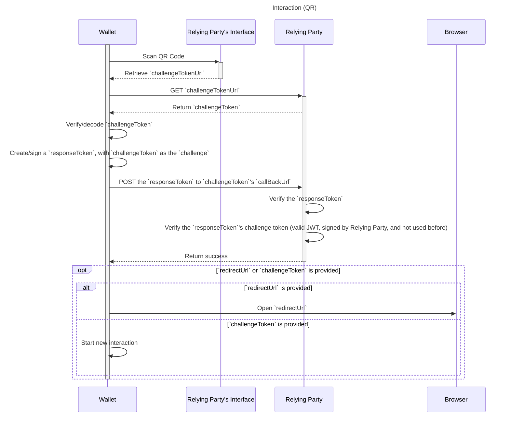
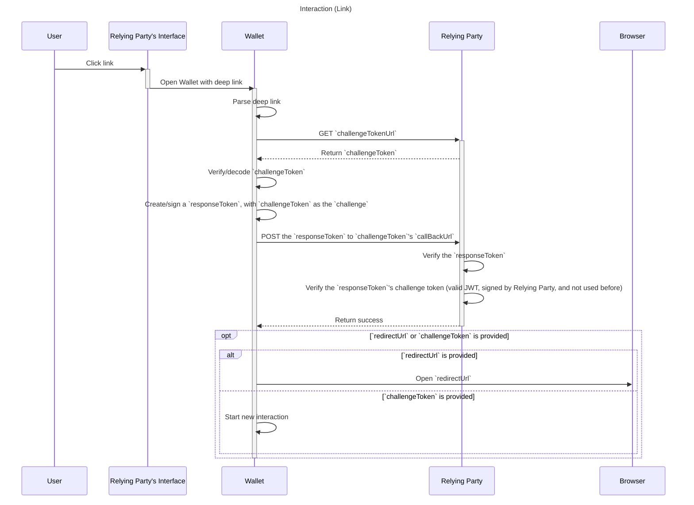
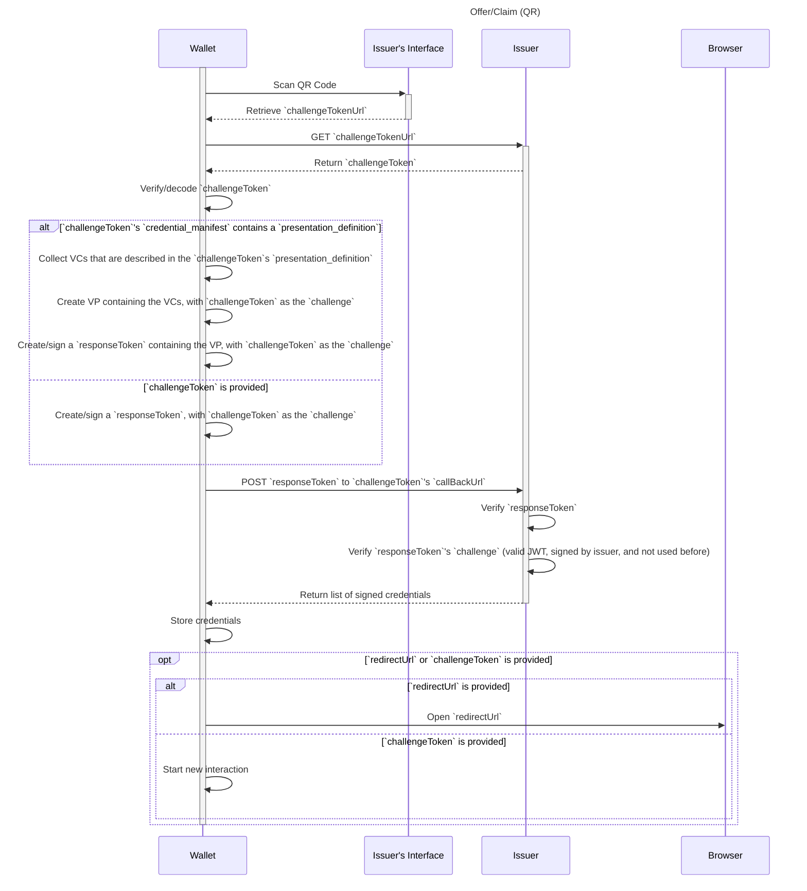
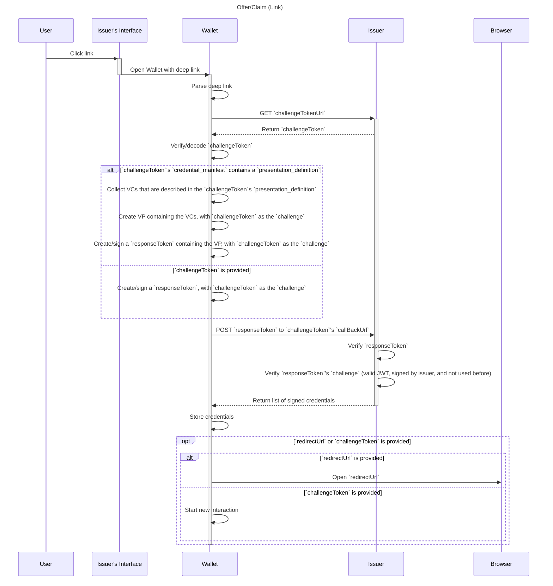
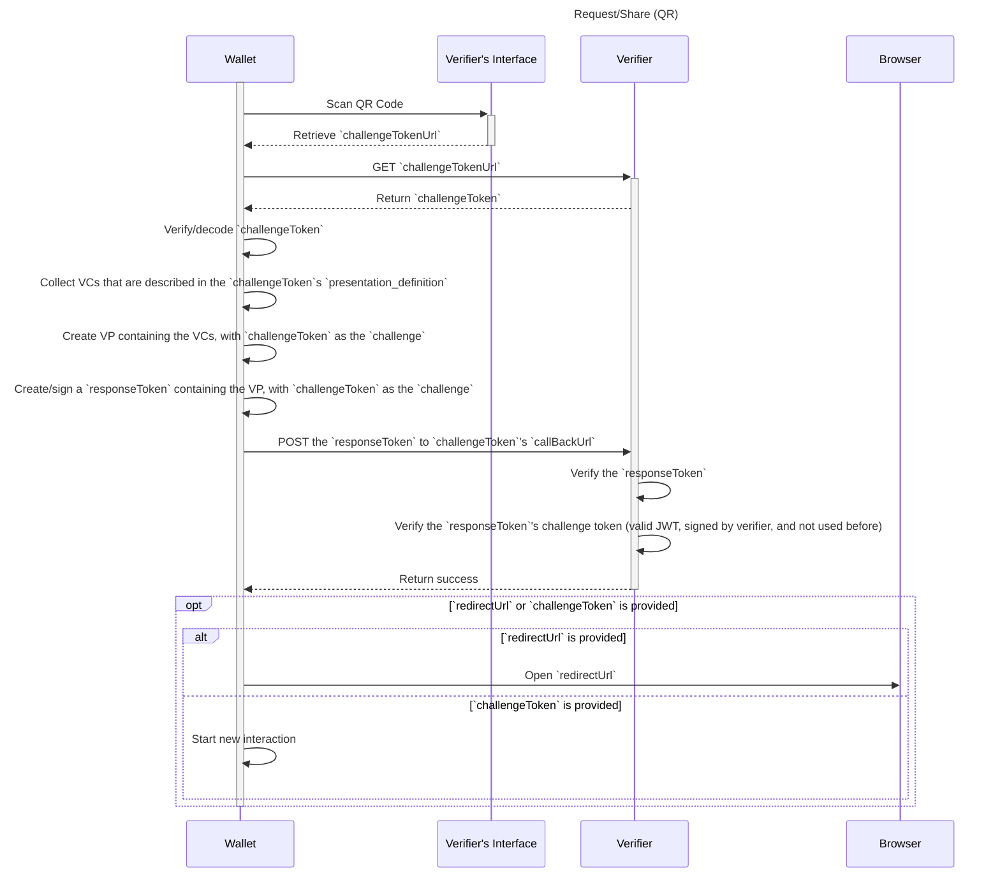
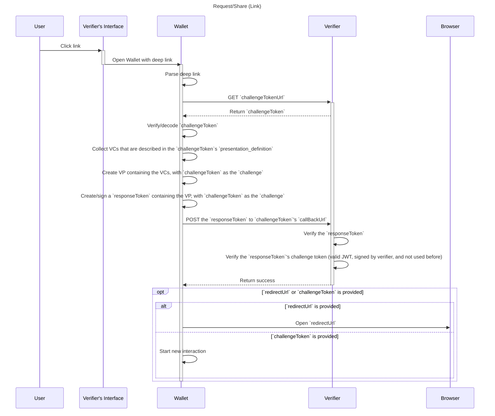

# Wallet Credential Interactions

> WACI [__wak__-ee]

**Specification Status:** Draft

**Editors:**
~ [Afshan Aman](https://www.linkedin.com/in/afshan-aman/) (Bloom)
~ [Eddie Hedges](https://www.linkedin.com/in/eddiehedges/) (Bloom)

**Contributors:**
~ [Jace Hensley](https://www.linkedin.com/in/jacehensley/) (Bloom)

**Participate:**
~ [GitHub repo](https://github.com/hellobloom/wallet-credential-interactions)
~ [File a bug](https://github.com/hellobloom/wallet-credential-interactions/issues)
~ [Commit history](https://github.com/hellobloom/wallet-credential-interactions/commits/master)

---

## Abstract

There are interactions between a wallet and relying party that require passing information between the two. WACI provides a standard for these interactions.

## Status of This Document

WACI is a draft specification under development by Bloom and Affinidi.

## Interactions

All interactions use the same common blocks:

### QR Code or Link

Two ways of initiating an interaction is for the relying party to display either a QR code or a link to the user. There could be other ways to initiate an interaction but this document will be discussing QR codes and links.

If the user is using an app/webiste on something other than the device that their wallet is on, then they would be able to scan a QR code with the wallet. _But_ if the user is using the device that also has their wallet then they wouldn't be able to scan a QR code, they would need to be able to click a link that will open their mobile wallet.

There are of course other use cases where you might need one over the other or both. For example, in an email you may want to display both a link and a QR code because you won't be able to dynamically choose between the two.

### Payload

Some mediums do not allow for a large amount of data to be sent (e.g a QR code) to support those cases the initial payload contains instructions for fetching the challenge token.

This is payload can be displayed in a QR code or added to a link as a query parameter.

<tab-panels selected-index="0">

<nav>
  <button type="button">QR</button>
  <button type="button">Link</button>
</nav>

<section>


</section>

<section>

<a target="_blank" rel="noopener noreferrer" href="https://deep-link-into-app.com/waci?payload=eyJjaGFsbGVuZ2VUb2tlblVybCI6Imh0dHBzOi8vZXhhbXBsZS5jb20vYXBpL2dldC10b2tlbi9mYjI4YjRlYy00MjA5LTRiNzgtODUwNy03Y2M0OTE2NGNiMzciLCJ2ZXJzaW9uIjoiMSJ9">Click Me!</a>

</section>

</tab-panels>

::: example QR/Link Payload

```json
{
  "challengeTokenUrl": "https://example.com/api/get-token/fb28b4ec-4209-4b78-8507-7cc49164cb37",
  "version": "1"
}
```

:::

- `challengeTokenUrl`:
  - MUST be unique to the interaction
  - MUST be a `GET` endpoint that returns the [Token Payload](#token-url-response)
- `version`:
  - This is the version of just the QR/link payload, not the rest of the interaction

### Token URL Response

The result from `GET`ing the provided `challengeTokenUrl`. This contains the initial JWT that really starts the interaction.

::: example Token URL Response

```json
{
  "challengeToken": "{{JWT String}}"
}
```

:::

#### Challenge Token

::: example Challenge Token Header

```json
// Header
{
  "alg": "...",
  "kid": "did:example:ebfeb1f712ebc6f1c276e12ec21#primary"
}
```

:::

- MUST have `alg` and `kid`, so the JWT can be verified

::: example Challenge Token Payload

```json
// Payload
{
  "jti": "...",
  "iss": "did:example:ebfeb1f712ebc6f1c276e12ec21",
  "aud": "...",
  "callbackUrl": "https://example.com/api/callback-url",
  "purpose": "...",
  "version": "..."
}
```

:::

- MUST have `iss`
- MUST have `jti` to protect against replay attacks
- CAN have `aud` if the DID of the wallet is known
- MUST have `callbackUrl`
  - MUST be a `POST` endpoint to take the wallet's reponse (payload determined by the `purpose`)
- MUST have `purpose`
- MUST have `version`
  - This is specific to the `purpose`

### Callback URL

#### Request

Each interaction will `POST` data to the `callbackUrl`:

::: example Callback URL Request Payload

```json
{
  "responseToken": "{{Signed JWT}}",
  "from": "qr" | "link"
}
```

:::

- `responseToken`
  - A JWT signed by the user, will contain the `challengeToken`
- `from`
  - MUST be either "qr" or "link"
  - The issuer may need to handle things differently based on how the user is claiming the credentials

##### Response Token

The response token is signed by the user and acts as a way to prove ownership of their DID and to pass aditional data back to the relying party.

:::example Response Token Header

```json
{
  "alg": "...",
  "kid": "did:example:c276e12ec21ebfeb1f712ebc6f1#primary"
}
```

:::

- MUST have `alg` and `kid`, so the JWT can be verified

:::example Response Token Payload

```json
{
  "iss": "did:example:c276e12ec21ebfeb1f712ebc6f1",
  "aud": "did:example:ebfeb1f712ebc6f1c276e12ec21",
  "challenge": "{{CHALLENGE TOKEN}}"
}
```

:::

- MUST have `iss`
- MUST have `aud`
  - `aud` MUST be the `iss` of the challenge token
- MUST have `challenge`
  - `challenge` MUST be the challenge token given by the issuer

#### Reponse

The `POST` to the provided `callbackUrl` can return with a simple successful HTTP response or it can return a success with follow up details. A `redirectLink` that the app will open in a browser or `challengeToken` that will start a new interaction.

::: example Response Redirect Payload

```json
{
  "redirectUrl": "https://example.com/redirect-url?id={{Some id that identifies the user}}"
}
```

:::

This could be used to show a success message or bring them back to the website/app to continue where they left off. Most of the time `redirectUrl` will only be used when the user is already using their phone (see [above](#qr-code-or-link)).

**OR**

::: example Response Chain Payload

```json
{
  "challengeToken": "{{JWT String}}"
}
```

:::

This could be used to follow up a request interaction with an offer interaction, or even a chain of request interactions that are based on the previously shared VCs.

### Token Storage

Because the challenge token is always sent back to the relying party, the token doesn't need to be stored on creation. And this allows the relying party to not have to worry about someone spamming their API and driving up their storage costs.

But no storage at all can lead to replay attacks. One suggested way to mitigate replay attacks while keeping storage to a minimal is to only store the hash of "used" tokens and have a cron job that cleans this storage based on expiration date of the tokens.

### Swimlane

Each interaction will be slightly different but will follow this general pattern:

<tab-panels selected-index="0">

<nav>
  <button type="button">QR Based</button>
  <button type="button">Link Based</button>
</nav>

<section>



</section>

<section>



</section>

</tab-panels>

## Offer/Claim

The offer/claim interaction is for the use case where an issuer wants to give credential(s) to the user.

### Challenge Token

An example of an `offer` challenge token has the following properties (in addition to the base [properties](#challenge-token)):

:::example Offer Challenge Token Header

```json
// Header
{
  "alg": "...",
  "kid": "did:example:ebfeb1f712ebc6f1c276e12ec21#primary"
}
```

:::

:::example Offer Challenge Token Payload

```json
// Payload
{
  "jti": "...",
  "iss": "did:example:ebfeb1f712ebc6f1c276e12ec21",
  "aud": "...",
  "callbackUrl": "https://example.com/api/callback-url",
  "purpose": "offer",
  "version": "1",
  /* Using [Credential Manifest](#credential-manifest-working-copy) to define the available credentials */
  "credential_manifest": {
    "issuer": {
      /* ... */
    },
    "credential": {
      /* ... */
    },
    "presentation_definition": {
      /* ... */
    }
  }
}
```

:::

- `purpose` MUST be `"offer"`
- MUST have `credential_manifest`
  - If the `credential_manifest` provides a `presentation_definition` the response MUST include a `verifiable_presentation`

### Callback URL

#### Request

The offer/claim interaction follows the standard [Callback URL Request](#request) payload, but the `responseToken`'s is specific to the this interaction.

:::example Offer Callback URL Request Payload

```json
{
  "responseToken": "{{Signed JWT}}",
  "from": "qr" | "link"
}
```

:::

##### Response Token

In addition to the standard `responseToken` the offer/claim interaction adds `verifiable_presentation` to the payload.

:::example Offer Response Token Header

```json
// Header
{
  "alg": "...",
  "kid": "did:example:c276e12ec21ebfeb1f712ebc6f1#primary"
}
```

:::

:::example Offer Response Token Payload

```json
// Payload
{
  "iss": "did:example:c276e12ec21ebfeb1f712ebc6f1",
  "aud": "did:example:ebfeb1f712ebc6f1c276e12ec21",
  "challenge": "{{CHALLENGE TOKEN}}",
  "verifiable_presentation": {
    /* ... */
    "type": ["VerifiablePresentation", "PresentationSubmission"],
    "presentation_submission": {
      /* Using Presentation Exchange's [Presentation Submission](https://identity.foundation/presentation-exchange/#presentation-submission) */
      /* ... */
    }
    /* ... */
  }
}
```

:::

- MUST have `verifiable_presentation` IF the challenge token provides a `presentation_definition`
  - This `VerifiablePresentation` MUST be a `PresentationSubmission`

#### Response

In addition to the standard [Callback URL Response](#response) payload, the offer/claim flow adds `credentials`:

:::example Offer Default Response Payload

```json
{
  "credentials": [
    {
      "type": ["VerifiableCredential" /* ... */]
      // ...
    }
  ]
}
```

:::

**OR**

:::example Offer Redirect Response Payload

```json
{
  "credentials": [
    {
      "type": ["VerifiableCredential" /* ... */]
      // ...
    }
  ],
  "redirectUrl": "https://example.com/redirect-url?id={{Some id that identifies the user}}"
}
```

:::

**OR**

:::example Offer Chain Response Payload

```json
{
  "credentials": [
    {
      "type": ["VerifiableCredential" /* ... */]
      // ...
    }
  ],
  "challengeToken": "{{JWT String}}"
}
```

:::

- `credentials` MUST be an array of Verifiable Credentials issued to the user.

### Swimlane

<tab-panels selected-index="0">

<nav>
  <button type="button">QR Based</button>
  <button type="button">Link Based</button>
</nav>

<section>



</section>

<section>



</section>

</tab-panels>

## Request/Share

The request/share interaction is for the use case where an verifier wants a user to share credential(s) with them.

### Challenge Token

An example of a `request` challenge token has the following properties (in addition to the base [properties](#challenge-token)):

:::example Request Challenge Token Header

```json
// Header
{
  "alg": "...",
  "kid": "did:example:ebfeb1f712ebc6f1c276e12ec21#primary"
}
```

:::

:::example Request Challenge Token Payload

```json
// Payload
{
  "jti": "...",
  "iss": "did:example:ebfeb1f712ebc6f1c276e12ec21",
  "aud": "...",
  "callbackUrl": "https://example.com/api/callback-url",
  "purpose": "request",
  "version": "1",
  /* Using [Presentation Exchange](https://identity.foundation/presentation-exchange/) to define the requirements */
  "presentation_definition": {
    // ...
  }
}
```

:::

- `purpose` MUST be `"request"`
- MUST have `presentation_definition`

### Callback URL

#### Request

In addition to the standard [Callback URL Request](#request) payload, the offer/claim flow adds `presentation`

:::example Request Callback URL Request Payload

```json
{
  "responseToken": "{{Signed JWT}}",
  "from": "qr" | "link"
}
```

:::

##### Response Token

In addition to the standard `responseToken` the offer/claim interaction adds `verifiable_presentation` to the payload.

:::example Request Response Token Header

```json
// Header
{
  "alg": "...",
  "kid": "did:example:c276e12ec21ebfeb1f712ebc6f1#primary"
}
```

:::

:::example Request Response Token Payload

```json
// Paylaod
{
  "iss": "did:example:c276e12ec21ebfeb1f712ebc6f1",
  "aud": "did:example:ebfeb1f712ebc6f1c276e12ec21",
  "challenge": "{{CHALLENGE TOKEN}}",
  "verifiable_presentation": {
    /* ... */
    "type": ["VerifiablePresentation", "PresentationSubmission"],
    "presentation_submission": {
      /* Using Presentation Exchange's [Presentation Submission](https://identity.foundation/presentation-exchange/#presentation-submission) */
      /* ... */
    }
    /* ... */
  }
}
```

:::

- MUST have `verifiable_presentation`
  - This `VerifiablePresentation` MUST be a `PresentationSubmission`
  - This `VerifiablePresentation`'s `proof.challenge` MUST be the challenge token given by the issuer

#### Response

The request/share flow does not add anything to the [Callback URL Response](#response).

### Swimlane

<tab-panels selected-index="0">

<nav>
  <button type="button">QR Based</button>
  <button type="button">Link Based</button>
</nav>

<section>



</section>

<section>



</section>

</tab-panels>

## Credential Manifest (Working Copy)

Because the [Credential Manifest spec](https://identity.foundation/credential-manifest) is just a strawman at the moment we will rely on a "frozen" copy of the spec outline below. The WACI spec will not be considered stable until the Credential Manifest spec is, but we want to be able to implement early prototypes against something so we need a version of the spec to base it off of.

This is the CM spec as of 02/22/2021.

Alterations in the spec are colored in <span style="color:darkgreen;">green</span>

---

# Credential Manifest

**Specification Status:** Strawman

**Latest Draft:**
[identity.foundation/credential-manifest](https://identity.foundation/credential-manifest)

**Editors:**
~ [Daniel Buchner](https://www.linkedin.com/in/dbuchner/) (Microsoft)
~ [Brent Zundel](https://www.linkedin.com/in/bzundel/) (Evernym)

<!-- -->

**Participate:**
~ [GitHub repo](https://github.com/decentralized-identity/credential-manifest)
~ [File a bug](https://github.com/decentralized-identity/credential-manifest/issues)
~ [Commit history](https://github.com/decentralized-identity/credential-manifest/commits/master)

---

### Abstract

For User Agents (e.g. wallets) and other service that wish to engage with Issuers to acquire credentials, there must exist a mechanism for assessing what inputs are required from a Subject to process a request for credential issuance. The _Credential Manifest_ is a common data format for describing the inputs a Subject must provide to an Issuer for subsequent evaluation and issuance of the credential indicated in the Credential Manifest.

_Credential Manifests_ do not themselves define the contents of the output credential, the process the Issuer uses to evaluate the submitted inputs, or the protocol Issuers, Subjects, and their User Agents rely on to negotiate credential issuance.

### Status of This Document

Credential Manifest is a draft specification being developed within the [Decentralized Identity Foundation](https://identity.foundation) (DIF), and intended for ratification as a DIF recommended data format. This spec will be updated to reflect relevant changes, and participants are encouraged to contribute at the following repository location: https://github.com/decentralized-identity/credential-manifest

### Terminology

| Term                           | Definition                                                                                                                                                                                                                                        |
| :----------------------------- | :------------------------------------------------------------------------------------------------------------------------------------------------------------------------------------------------------------------------------------------------ |
| Decentralized Identifier (DID) | Unique ID string and PKI metadata document format for describing the cryptographic keys and other fundamental PKI values linked to a unique, user-controlled, self-sovereign identifier in a target system (i.e. blockchain, distributed ledger). |
| Issuer                         | An entity that issues a credential to a Subject.                                                                                                                                                                                                  |
| Holder                         | The entity that submits proofs to a Verifier to satisfy the requirements described in a Proof Definition                                                                                                                                          |
| Verifier                       | The entity that defines what proofs they require from a Subject (via a Proof Definition) in order to proceed with an interaction.                                                                                                                 |

### Resource Definition

_Credential Manifests_ are a resource format that defines preconditional requirements, Issuer style preferences, and other facets User Agents utilize to help articulate and select the inputs necessary for processing and issuance of a specified credential.

::: example Credential Manifest - All features exercised

```json
{
  "locale": "en-US",
  "issuer": {
    "id": "did:example:123",
    "name": "Washington State Government",
    "styles": {
      "thumbnail": {
        "uri": "https://dol.wa.com/logo.png",
        "alt": "Washington State Seal"
      },
      "hero": {
        "uri": "https://dol.wa.com/people-working.png",
        "alt": "People working on serious things"
      },
      "background": {
        "color": "#ff0000"
      },
      "text": {
        "color": "#d4d400"
      }
    }
  },
  "credential": {
    "schema": "https://schema.org/EducationalOccupationalCredential",
    "display": {
      "title": {
        "path": ["$.name", "$.vc.name"],
        "text": "Washington State Driver License"
      },
      "subtitle": {
        "path": ["$.class", "$.vc.class"],
        "text": "Class A, Commercial"
      },
      "description": {
        "text": "License to operate a vehicle with a gross combined weight rating (GCWR) of 26,001 or more pounds, as long as the GVWR of the vehicle(s) being towed is over 10,000 pounds."
      },
      "properties": [
        {
          "path": ["$.donor", "$.vc.donor"],
          "label": "Organ Donor"
        }
      ]
    },
    "styles": {
      "thumbnail": {
        "uri": "https://dol.wa.com/logo.png",
        "alt": "Washington State Seal"
      },
      "hero": {
        "uri": "https://dol.wa.com/happy-people-driving.png",
        "alt": "Happy people driving"
      },
      "background": {
        "color": "#ff0000"
      },
      "text": {
        "color": "#d4d400"
      }
    }
  },
  "presentation_definition": {
    // As defined in the Presentation Exchange specification
  }
}
```

:::

#### General Composition

_Credential Manifests_ are JSON objects composed as follows:

- The object \***\*MAY\*\*** contain a `locale` property, and if present, its value \***\*MUST\*\*** be an [IETF BCP 47](https://tools.ietf.org/html/bcp47) language tag. Wrapping transports such as HTTP may choose to utlilize the `locale` property in conjunction with the [Accept-Language](https://tools.ietf.org/html/rfc7231#section-5.3.5) header.
- The object \***\*MUST\*\*** contain an `issuer` property, and its value \***\*MUST\*\*** be an object composed as follows:
  - The object \***\*must\*\*** contain a `id` property, and its value \***\*must\*\*** be a valid URI string that identifies who the issuer of the credential will be.
  - The object \***\*MAY\*\*** contain a `name` property, and its value \***\*must\*\*** be a string that \***\*SHOULD\*\*** reflect the human-readable name the Issuer wishes to be recognized by.
  - The object \***\*MAY\*\*** contain a `styles` property, and its value \***\*must\*\*** be an object composed as defined in the [`styles` properties](#styles-properties) section.
- The object \***\*MUST\*\*** contain a `credential` property, and its value \***\*MUST\*\*** be an object composed as follows:
  - The object \***\*MUST\*\*** contain a `schema` property, and its value \***\*MUST\*\*** be a valid URI string for the schema of the credential that is available for issuance via the containing Credential Manifest.
  - The object \***\*MAY\*\*** contain a `name` property, and if present its value \***\*SHOULD\*\*** be a human-friendly name that describes what the credential represents.
  - The object \***\*MAY\*\*** contain a `description` property, and if present its value \***\*MUST\*\*** be a string that describes what the credential is in greater detail.
  - The object \***\*MAY\*\*** contain a `styles` property, and its value \***\*must\*\*** be an object composed as defined in the [`styles` properties](#styles-properties) section.
  - The object \***\*MAY\*\*** contain a `display` property, and its value \***\*must\*\*** be an object composed as defined in the [`display` properties](#display-properties) section.
- The object \***\*MAY\*\*** contain a `presentation_definition` object, and its value \***\*MUST\*\*** be a [Presentation Definition](https://identity.foundation/presentation-exchange/#presentation-definition) object, as defined by the [DIF Presentation Exchange](https://identity.foundation/presentation-exchange) specification.

#### `styles` properties

Within a `Credential Manifest`, there are two areas where styling affordances are provided: under the `issuer` property, where the Issuer expresses information about themselves - including how a User Agent should style UI that represents the Issuer, and under the `credential` property, where the Issuer expresses information about the credntial itself - including how a User Agent should style UI for the credential itself. Under each of these areas an implementer \***\*MAY\*\*** include a `styles` property, and if present, its value \***\*must\*\*** be an object composed of the following properties:

- The object \***\*MAY\*\*** contain a `thumbnail` property, and if present, its value \***\*MUST\*\*** be an object with the following optional properties:
  - The object \***\*MUST\*\*** contain a `uri` property, and if present its value \***\*MUST\*\*** be a valid URI string to an image resource.
  - The object \***\*MAY\*\*** contain an `alt` property, and if present its value \***\*MUST\*\*** be a string that describes the alternate text for the logo image.
- The object \***\*MAY\*\*** contain a `hero` property, and if present, its value \***\*MUST\*\*** be an object with the following optional properties:
  - The object \***\*MUST\*\*** contain a `uri` property, and if present its value \***\*MUST\*\*** be a valid URI string to an image resource.
  - The object \***\*MAY\*\*** contain an `alt` property, and if present its value \***\*MUST\*\*** be a string that describes the alternate text for the logo image.
- The object \***\*MAY\*\*** contain a `background` property, and if present, its value \***\*MUST\*\*** be an object with the following optional properties:
  - The object \***\*MAY\*\*** contain a `color` property, and if present its value \***\*MUST\*\*** be a HEX string color value (e.g. #000000).
- The object \***\*MAY\*\*** contain a `text` property, and if present, its value \***\*MUST\*\*** be an object with the following optional properties:
  - The object \***\*MAY\*\*** contain a `color` property, and if present its value \***\*MUST\*\*** be a HEX string color value (e.g. #000000).

#### `display` properties

The `credential` property of a `Credential Manifest` is an object that \***\*MAY\*\*** contain a `display` property defining various content and data pointers for representation of a credential in UI. The properties in the object use _Display Mapping Objects_ to assign text and data about the credential to common UI presentation elements, either by selecting data from the credential itself or providing it directly. The `display` object is constructed as follows

- The object \***\*MAY\*\*** contain a `title` property, and if present, its value \***\*MUST\*\*** be a _Display Mapping Object_. User Agents \***\*SHOULD\*\*** render the data in an area of UI that conveys the general title of the credential being rendered.
- The object \***\*MAY\*\*** contain a `subtitle` property, and if present, its value \***\*MUST\*\*** be a _Display Mapping Object_. User Agents \***\*SHOULD\*\*** render the data in close proximity to the `title` value and \***\*SHOULD\*\*** display the information in a way that is noticably less pronounced than that of the `title` value.
- The object \***\*MAY\*\*** contain a `description` property, and if present, its value \***\*MUST\*\*** be a _Display Mapping Object_. User Agents \***\*SHOULD\*\*** render the data in an area of UI that is appropreate for verbose, descriptive textual data.
- The object \***\*MAY\*\*** contain a `properties` property, and if present, its value \***\*MUST\*\*** be an array of _Display Mapping Objects_. User Agents \***\*SHOULD\*\*** render the data specified by each _Display Mapping Object_ in an area of UI that is appropreate for the rendering of a flat list of labeled values.

##### _Display Mapping Objects_

::: example Display Mapping Object

```json
{
  "display": {
    "title": {
      "path": ["$.name", "$.vc.name"],
      "text": "Washington State Driver License"
    },
    "properties": [
      {
        "path": ["$.vision_aid", "$.vc.vision_aid"],
        "label": "Vision aid required"
      },
      {
        "path": ["$.donor", "$.vc.donor"],
        "label": "Organ Donor"
      }
    ]
  }
}
```

:::

The _Display Mapping Objects_ are JSON objects constructed as follows:

- The object \***\*MAY\*\*** contain a `path` property, and if present, its value \***\*MUST\*\*** be a [JSONPath](https://goessner.net/articles/JsonPath/) string expression <span style="color:darkgreen;">and the result \***\*MUST\*\*** be a string or numeric value that is rendered in the UI<span>.
- The object \***\*MAY\*\*** contain a `text` property, and if present, its value \***\*MUST\*\*** be a string or numeric value that is rendered in the UI if no `path` property is specified within the object, or all of the `path` property's array of [JSONPath](https://goessner.net/articles/JsonPath/) string expressions fail to select data within the target credential.
- The object \***\*MAY\*\*** contain a `label` property, and if present, its value \***\*MUST\*\*** be a string that is rendered in the UI if the property for which the object defines is appropreate for labeled data display. If the property is intended for labeled display, the label \***\*SHOULD\*\*** be shown in the UI and the value paired with the label \***\*SHOULD\*\*** be either data selected from the processing of the `path` property's [JSONPath](https://goessner.net/articles/JsonPath/) string expressions, or the value specified by the `text` property. If neither is present, display of the label and any fallback value is at the election of the implementer.

### Resource Location

Credential Manifests \***\*should\*\*** be retrievable at known, semantic locations that are generalized across all entities, protocols, and transports. This specification does not stipulate how Credential Manifests must be located, hosted, or retrieved, but does advise that Issuers \***\*SHOULD\*\*** make their Credential Manifests available via an instance of the forthcoming semantic personal datastore standard being developed by DIF, W3C, and other groups (e.g. Identity Hubs).
