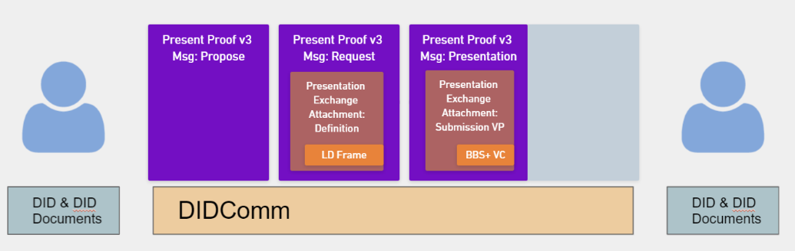
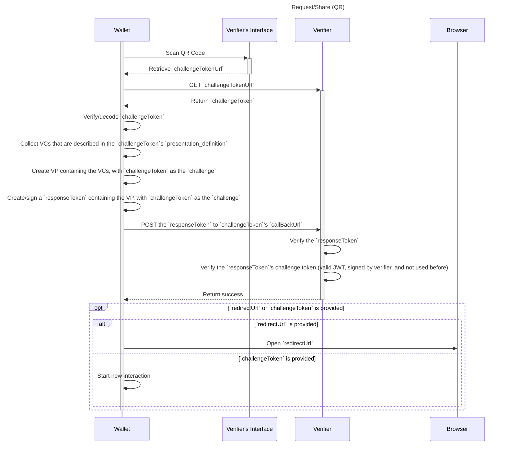
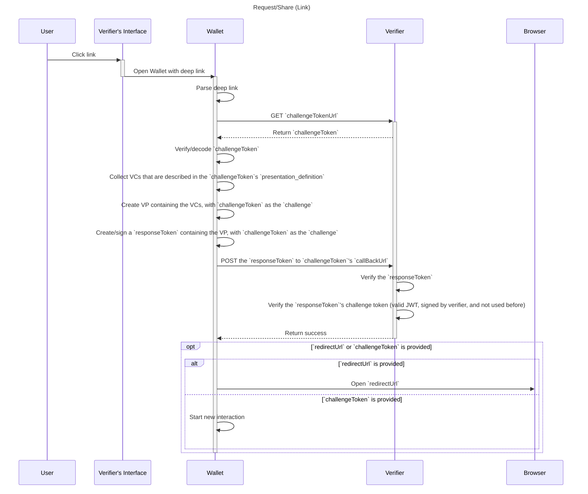

# Wallet And Credential Interactions

> WACI [__wak__-ee]

**Specification Status:** Draft

**Editors:**
~ [Orie Steele](https://www.linkedin.com/in/or13b/) (Transmute)
~ [Brent Zundel](https://www.linkedin.com/in/bzundel/) (Evernym)

**Authors:**
~ [Afshan Aman](https://www.linkedin.com/in/afshan-aman/) (Bloom)
~ [Eddie Hedges](https://www.linkedin.com/in/eddiehedges/) (Bloom)
~ [Jace Hensley](https://www.linkedin.com/in/jacehensley/) (Bloom)

**Participate:**
~ [GitHub repo](https://github.com/decentralized-identity/waci-presentation-exchange)
~ [File a bug](https://github.com/decentralized-identity/waci-presentation-exchange/issues)
~ [Commit history](https://github.com/decentralized-identity/waci-presentation-exchange/commits/master)

---

## Abstract

There are interactions between a wallet and relying party that require passing
information between the two. The PRE-DRAFT [Wallet and Credential Interactions specification](https://github.com/decentralized-identity/wallet-and-credential-interactions) ("WACI") provides a tentative protocol definition for these interactions, and is being iterated in the [DIF Claims and Credentials Working Group](https://identity.foundation/working-groups/claims-credentials.html).

This document describes an interoperability profile which incorporates elements from a number of existing specifications and protocols, without assuming or requiring an implementer understand all of them. It inherits its overall structure from a
[the current pre-draft of WACI](https://github.com/decentralized-identity/wallet-and-credential-interactions),
but makes use of
[DIDComm v2.0](https://github.com/decentralized-identity/didcomm-messaging)
communication protocols, along with
[Aries Present Proof](https://github.com/hyperledger/aries-rfcs/blob/master/features/0454-present-proof-v2/README.md)
message formats and
[DIF Presentation Exchange](https://identity.foundation/presentation-exchange/)
data objects.

It is anticipated that future versions of this specification will add
support for additional messaging, transport, or other mechanisms beyond those
used in v0.1.



## Status of This Document

WACI v0.1 is a _PRE-DRAFT_ specification under development by the [DIF Claims and Credentials Working Group](https://identity.foundation/working-groups/claims-credentials.html).


## Presentation Exchange Context

TBD

## DIDComm Context

The exchange specified in the [DIDComm v2
specification](https://identity.foundation/didcomm-messaging/spec/) is presumed
to take place between two subjects that control DIDs with certain properties,
and can take place over many different transports. Having a connection means that each party in the relationship has a DID for the other parties, and parties can communicate securely using the keys and endpoints within each DID Document. 

#### Service block expected in DID Documents for DIDComm

Both parties MUST have a `service` block containing the following properties:

```json
"service": [{
    "id": "did:example:123123123#someid",
    "type": "DIDCommMessaging",
    "serviceEndpoint": "https://example.com/endpoint",
    "routingKeys": ["did:example:somemediator#somekey"]
  }]
``` 

TODO: Explain routing keys. Each property and normative status:
- service block must be present
- `id` MUST contain a unique id
- `type` MUST be `DIDCommMessaging`
- `serviceEndpoint` MUST be a resolvable URI
- `routingKeys` MUST contain valid routing keys (ref directly to DIDComm spec section about routing keys)

#### Establishing an HTTP(S) Connection

In order to establish a new connection, Simply exchange a new message between parties. Knowing the DID of the other parties does not indicate any level of trust.

The assumptions and requirements for using an HTTP(S) connection for sending,
routing, and receiving DIDComm packets are described in the [HTTP(S)
section](https://identity.foundation/didcomm-messaging/spec/#https) of the
DIDComm v2 specification.


## WACI Protocol Context

The interactions, objects, and assumptions outlined in the WACI pre-draft specification are the basis for the following.  Specifically, the profile describes the [Request/Share flow](https://identity.foundation/wallet-and-credential-interactions/#requestshare). As an overview, see this flow diagram:

<tab-panels selected-index="0">

<nav>
  <button type="button">QR Based</button>
  <button type="button">Link Based</button>
</nav>

<section>



</section>

<section>



</section>

</tab-panels>

## Interoperability Profile 

### Step 1 - Generate QR Code

The QR code used to start a presentation is constructed by encoding a json based message into a URI, then encoding that URI into a QR code.

#### JSON message

The contents of the QR code to be generated can described in the following JSON bloc, which is also what DIDComm v2 calls an "out of band invitation."

```json=
{
  "type": "https://didcomm.org/out-of-band/2.0/invitation",
  "id": "<new id used for context as pthid for all future messages in this exchange>",
  "from": "did:example:verifier",
  "body": {
      "goal_code": "streamlined-vp",
      "accept": ["didcomm/v2"]
  }
}
```

#### Encoding

To encode this message, remove all json whitespace and Base 64 URL encode. The result should look like this, for the example above:

```
eyJ0eXBlIjoiaHR0cHM6Ly9kaWRjb21tLm9yZy9vdXQtb2YtYmFuZC8yLjAvaW52aXRhdGlvbiIsImlkIjoiPGlkIHVzZWQgZm9yIGNvbnRleHQgYXMgcHRoaWQ-IiwiZnJvbSI6ImRpZDpleGFtcGxlOnZlcmlmaWVyIiwiYm9keSI6eyJnb2FsX2NvZGUiOiJzdHJlYW1saW5lZC12cCIsImFjY2VwdCI6WyJkaWRjb21tL3YyIl19fQ==
```

Prepend this encoded string with a domain and path, and a query parameter of `_oob` set to the encoded message. 

```
https://example.com/some/path?_oob=eyJ0eXBlIjoiaHR0cHM6Ly9kaWRjb21tLm9yZy9vdXQtb2YtYmFuZC8yLjAvaW52aXRhdGlvbiIsImlkIjoiPGlkIHVzZWQgZm9yIGNvbnRleHQgYXMgcHRoaWQ-IiwiZnJvbSI6ImRpZDpleGFtcGxlOnZlcmlmaWVyIiwiYm9keSI6eyJnb2FsX2NvZGUiOiJzdHJlYW1saW5lZC12cCIsImFjY2VwdCI6WyJkaWRjb21tL3YyIl19fQ==
```

#### QR Code generated 

TODO: Sam will make a QR from the above and paste it here; perhaps also describe the libraries/parameters/etc used?  See issue #13

#### QR Code scanning and processing

The URI, if loaded into a browser should display instructions on how to download and use a mobile application. If scanned inside an app that understands this protocol, the message should be extracted from the URI's `_oob` query parameter and processed without resolving the URI. This behavior allows for a better fallback user experience should a user encounter a QR code without having a suitable app.

### Step 2 - Send Message Proposing Presentation

A "Propose Presentation" message, optional in many cases, is defined in [Aries
RFC
0454](https://github.com/hyperledger/aries-rfcs/tree/master/features/0454-present-proof-v2#messages)
and its Presentation Exchange "attachment" defined in [RFC
0510](https://github.com/hyperledger/aries-rfcs/blob/master/features/0510-dif-pres-exch-attach/README.md#propose-presentation-attachment-format).
It either initiates a Request/Share interaction or answers an earlier invitation
to do so; it can be functionally equivalent to the request for a challenge token
in the [challenge token section](#challenge-token-2) above:

```json
{
    "type": "https://didcomm.org/present-proof/3.0/propose-presentation",
    "id": "95e63a5f-73e1-46ac-b269-48bb22591bfa",
    "thid": "599f3638-b563-4937-9487-dfe55099d900",
    "from": "did:example:prover",
    "to": "did:example:verifier"
}
```

Note: `id`s can be any arbitrary string used to identify each message, such as a
UUID or a hash, but the `id` of the initial message should be included as `thid`
("thread id"). In the above example, `id` of the message that established a
connection was used for `thid`; `thid` could also be unspecified if this
message were the first one over the channel or if a connection had been
established out of band.

### Step 3 - Send Message Requesting Presentation

The [v2] request for a Verifiable Presentation is defined in the "request
presentation" section of [Aries RFC
0454](https://github.com/hyperledger/aries-rfcs/tree/master/features/0454-present-proof-v2#request-presentation)
and the attachment format for Presentation Exchange objects is defined in [Aries
RFC
0510](https://github.com/hyperledger/aries-rfcs/blob/master/features/0510-dif-pres-exch-attach/README.md#request-presentation-attachment-format).
The challenge token that the holder will use to generate a replay-resistant VP
is included in the the `options` object within the `dif` object, encoded as a
DIDComm attachment:

```json
{
  "type": "https://didcomm.org/present-proof/3.0/request-presentation",
  "id": "0ac534c8-98ed-4fe3-8a41-3600775e1e92",
  "thid": "95e63a5f-73e1-46ac-b269-48bb22591bfa",
  "from": "did:example:prover",
  "to": "did:example:verifier",
  "body": {},
  "attachments": [
    {
      "@id": "ed7d9b1f-9eed-4bde-b81c-3aa7485cf947",
      "mime-type": "application/json",
      "format": "dif/presentation-exchange/definitions@v1.0",
      "data": {
        "json": {
          "dif": {
            "options": {
              "challenge": "3fa85f64-5717-4562-b3fc-2c963f66afa7",
              "domain": "4jt78h47fh47"
            },
            "presentation_definition": {
              "id": "32f54163-7166-48f1-93d8-ff217bdb0654",
              "frame": {
                "@context": [
                    "https://www.w3.org/2018/credentials/v1",
                    "https://w3id.org/vaccination/v1",
                    "https://w3id.org/security/suites/bls12381-2020/v1"
                  ],
                  "type": ["VerifiableCredential", "VaccinationCertificate"],
                  "credentialSubject": {
                    "@explicit": true,
                    "type": ["VaccinationEvent"],
                    "batchNumber": {},
                    "countryOfVaccination": {}
                  }
                },
                "input_descriptors": [
                  {
                    "id": "vaccination_input",
                    "name": "Vaccination Certificate",
                    "schema": "https://w3id.org/vaccination/#VaccinationCertificate",
                    "constraints": {
                      "fields": [
                        {
                          "path": ["$.credentialSubject.batchNumber"],
                          "filter": {
                            "type": "string"
                          }
                        },
                        {
                          "path": ["$.credentialSubject.countryOfVaccination"],
                          "filter": {
                            "type": "string"
                          }
                        }
                      ]
                    }
                  }
                ]
            }
          }
        }
      }
    }
  ]
}
```

For context on the Vaccination object passed, see the W3C-CCG [Vaccination
Vocabulary](https://w3c-ccg.github.io/vaccination-vocab/), from which the
example is drawn.

### Step 4 - Present Proof 

The Verifiable Presentation is again returned as an attachment (defined by [RFC
0510](https://github.com/hyperledger/aries-rfcs/blob/master/features/0510-dif-pres-exch-attach/README.md#presentation-attachment-format))
to a DIDComm
[present-proof](https://github.com/hyperledger/aries-rfcs/tree/master/features/0454-present-proof-v2#presentation)
message.  Note the `challenge` from the previous message is given in the `proof`
object for the VP and used to generate the signature there.

```json
{
  "type": "https://didcomm.org/present-proof/3.0/presentation",
  "id": "f1ca8245-ab2d-4d9c-8d7d-94bf310314ef",
  "thid": "95e63a5f-73e1-46ac-b269-48bb22591bfa",
  "from": "did:example:verifier",
  "to": "did:example:prover",
  "body": {},
  "attachments": [
    {
      "@id": "2a3f1c4c-623c-44e6-b159-179048c51260",
      "mime-type": "application/ld+json",
      "format": "dif/presentation-exchange/submission@v1.0",
      "data": {
        "@context": [
          "https://www.w3.org/2018/credentials/v1",
          "https://identity.foundation/presentation-exchange/submission/v1"
        ],
        "type": [
          "VerifiablePresentation",
          "PresentationSubmission"
        ],
        "holder": "did:example:123",
        "verifiableCredential": [
          {
            "@context": [
              "https://www.w3.org/2018/credentials/v1",
              "https://w3id.org/vaccination/v1",
              "https://w3id.org/security/bbs/v1"
            ],
            "id": "urn:uvci:af5vshde843jf831j128fj",
            "type": [
              "VaccinationCertificate",
              "VerifiableCredential"
            ],
            "description": "COVID-19 Vaccination Certificate",
            "name": "COVID-19 Vaccination Certificate",
            "expirationDate": "2029-12-03T12:19:52Z",
            "issuanceDate": "2019-12-03T12:19:52Z",
            "issuer": "did:example:456",
            "credentialSubject": {
              "id": "urn:bnid:_:c14n2",
              "type": "VaccinationEvent",
              "batchNumber": "1183738569",
              "countryOfVaccination": "NZ"
            },
            "proof": {
              "type": "BbsBlsSignatureProof2020",
              "created": "2021-02-18T23:04:28Z",
              "nonce": "JNGovx4GGoi341v/YCTcZq7aLWtBtz8UhoxEeCxZFevEGzfh94WUSg8Ly/q+2jLqzzY=",
              "proofPurpose": "assertionMethod",
              "proofValue": "AB0GQA//jbDwMgaIIJeqP3fRyMYi6WDGhk0JlGJc/sk4ycuYGmyN7CbO4bA7yhIW/YQbHEkOgeMy0QM+usBgZad8x5FRePxfo4v1dSzAbJwWjx87G9F1lAIRgijlD4sYni1LhSo6svptDUmIrCAOwS2raV3G02mVejbwltMOo4+cyKcGlj9CzfjCgCuS1SqAxveDiMKGAAAAdJJF1pO6hBUGkebu/SMmiFafVdLvFgpMFUFEHTvElUQhwNSp6vxJp6Rs7pOVc9zHqAAAAAI7TJuDCf7ramzTo+syb7Njf6ExD11UKNcChaeblzegRBIkg3HoWgwR0hhd4z4D5/obSjGPKpGuD+1DoyTZhC/wqOjUZ03J1EtryZrC+y1DD14b4+khQVLgOBJ9+uvshrGDbu8+7anGezOa+qWT0FopAAAAEG6p07ghODpi8DVeDQyPwMY/iu2Lh7x3JShWniQrewY2GbsACBYOPlkNNm/qSExPRMe2X7UPpdsxpUDwqbObye4EXfAabgKd9gCmj2PNdvcOQAi5rIuJSGa4Vj7AtKoW/2vpmboPoOu4IEM1YviupomCKOzhjEuOof2/y5Adfb8JUVidWqf9Ye/HtxnzTu0HbaXL7jbwsMNn5wYfZuzpmVQgEXss2KePMSkHcfScAQNglnI90YgugHGuU+/DQcfMoA0+JviFcJy13yERAueVuzrDemzc+wJaEuNDn8UiTjAdVhLcgnHqUai+4F6ONbCfH2B3ohB3hSiGB6C7hDnEyXFOO9BijCTHrxPv3yKWNkks+3JfY28m+3NO0e2tlyH71yDX0+F6U388/bvWod/u5s3MpaCibTZEYoAc4sm4jW03HFYMmvYBuWOY6rGGOgIrXxQjx98D0macJJR7Hkh7KJhMkwvtyI4MaTPJsdJGfv8I+RFROxtRM7RcFpa4J5wF/wQnpyorqchwo6xAOKYFqCqKvI9B6Y7Da7/0iOiWsjs8a4zDiYynfYavnz6SdxCMpHLgplEQlnntqCb8C3qly2s5Ko3PGWu4M8Dlfcn4TT8YenkJDJicA91nlLaE8TJbBgsvgyT+zlTsRSXlFzQc+3KfWoODKZIZqTBaRZMft3S/",
              "verificationMethod": "did:example:123#key-1"
            }
          }
        ],
        "presentation_submission": {
          "id": "1d257c50-454f-4c96-a273-c5368e01fe63",
          "definition_id": "32f54163-7166-48f1-93d8-ff217bdb0654",
          "descriptor_map": [
            {
              "id": "vaccination_input",
              "format": "ldp_vp",
              "path": "$.verifiableCredential[0]"
            }
          ]
        },
        "proof": {
          "type": "Ed25519Signature2018",
          "verificationMethod": "did:example:123#key-0",
          "created": "2021-05-14T20:16:29.565377",
          "proofPurpose": "authentication",
          "challenge": "3fa85f64-5717-4562-b3fc-2c963f66afa7",
          "jws": "eyJhbGciOiAiRWREU0EiLCAiYjY0IjogZmFsc2UsICJjcml0IjogWyJiNjQiXX0..7M9LwdJR1_SQayHIWVHF5eSSRhbVsrjQHKUrfRhRRrlbuKlggm8mm_4EI_kTPeBpalQWiGiyCb_0OWFPtn2wAQ"
        }
      }
    }
  ]
}
```

For context on the Vaccination object passed, see the W3C-CCG [Vaccination
Vocabulary](https://w3c-ccg.github.io/vaccination-vocab/), from which the
example is drawn.

## Appendix

### Out of Scope
The following are items that were considered "out of scope" for v0.1, but which
may be considered for future versions:

1. 