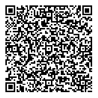

# Wallet And Credential Interactions

> WACI [__wak__-ee]

**Specification Status:** Draft

**Editors:**
~ [Orie Steele](https://www.linkedin.com/in/or13b/) (Transmute)
~ [Brent Zundel](https://www.linkedin.com/in/bzundel/) (Evernym)

**Authors:**
~ [Afshan Aman](https://www.linkedin.com/in/afshan-aman/) (Bloom)
~ [Eddie Hedges](https://www.linkedin.com/in/eddiehedges/) (Bloom)
~ [Jace Hensley](https://www.linkedin.com/in/jacehensley/) (Bloom)

**Participate:**
~ [GitHub repo](https://github.com/decentralized-identity/waci-presentation-exchange)
~ [File a bug](https://github.com/decentralized-identity/waci-presentation-exchange/issues)
~ [Commit history](https://github.com/decentralized-identity/waci-presentation-exchange/commits/master)

---

## Abstract

There are interactions between a wallet and relying party that require passing
information between the two. This specification provides an initial protocol
definition for these interactions. 

This document describes an interoperability profile which incorporates elements
from a number of existing specifications and protocols, without assuming or
requiring an implementer to understand all of them. It inherits its overall
structure from 
[the current pre-draft of WACI](https://github.com/decentralized-identity/wallet-and-credential-interactions),
but makes use of elements from the
[DIDComm v2.0](https://github.com/decentralized-identity/didcomm-messaging)
messaging protocol, along with
[Aries Present Proof](https://github.com/hyperledger/aries-rfcs/blob/master/features/0454-present-proof-v2/README.md)
message formats and
[DIF Presentation Exchange](https://identity.foundation/presentation-exchange/spec/v1.0.0/)
data objects. This version of the specification also restricts itself to
[Verifiable Credentials](https://www.w3.org/TR/vc-data-model/) which make use of
[BBS+ LD-Signatures](https://w3c-ccg.github.io/ldp-bbs2020).

It is anticipated that future versions of this specification will add
support for a much broader range of messaging and data-sharing formats than
those used in v0.1.

## Status of This Document

WACI v0.1 is a _PRE-DRAFT_ specification under development by the
[DIF Claims and Credentials Working Group](https://identity.foundation/working-groups/claims-credentials.html).

We encourage reviewers to submit issues on
[GitHub](https://github.com/decentralized-identity/waci-presentation-exchange/issues).

## Introduction

The 32nd Internet Identity Workshop (IIW) hosted a series of sessions about
designing an interoperable protocol for requesting and providing verifiable
information. The sessions lasted many hours over the course of several days and
resulted in interest among the participants in continuing to work out the
details of such a protocol, as well as a rough consensus around a set of
components that could be used in a layered approach for the design. We outline
some of the reasons for choosing each of the components below. 


### Verifiable Presentations
The starting point for most participants in determining which components to
select was the
[Verifiable Credentials Data Model]((https://www.w3.org/TR/vc-data-model/)). It
describes a `Verifiable Presentation` object that is designed for sharing
information from `Verifiable Credentials`. 

### BBS+ LD-Signatures
Though a [number of signature types](https://www.lfph.io/wp-content/uploads/2021/02/Verifiable-Credentials-Flavors-Explained.pdf)
are used with `Verifiable Credentials`, many in the community seem to be
converging on [BBS+ LD-Signatures](https://w3c-ccg.github.io/ldp-bbs2020). The
reasons for this convergence are more fully described
[elsewhere](https://www.evernym.com/blog/bbs-verifiable-credentials/), but the
summary is that they bridge the two primary concerns of `Verifiable Credential`
implementers: ease of use and user privacy.

### Presentation Exchange
The next component is a data model that provides a solution to the problem of
how to format a request that verifiable information be presented. The
[Presentation Exchange specification](https://identity.foundation/presentation-exchange/spec/v1.0.0/)
was recently published by the Decentralized Identity Foundation. It defines a
`Presentation Definition` data object which may be used by a relying party to
request information, and a `Presentation Submission` object which describes the
relationship between the `Presentation Definition` and the submitted verifiable
information.

Since
[Presentation Exchange](https://identity.foundation/presentation-exchange/spec/v1.0.0/)
supports the use of `Verifiable Presentations` as a response to a `Presentation
Definition`, while remaining agnostic to transport protocols, it is ideal for
our purposes.

### Communication, Transport, and Protocol
Previously described components were, for the most part, agreed upon readily.
The bulk of the conversations at IIW centered around communication and protocol
options and sought to answer the following questions:
- "How should the data objects be communicated from one party to another?"
- "How ought they to be transported securely?"
- "What protocol could be used for the exchange?"

#### DIDComm
Before participants settled on using elements of
[DIDComm v2.0](https://identity.foundation/didcomm-messaging/spec/) to securely
communicate the data objects, there was a long and lively discussion about other
options. 

[CHAPI](https://w3c-ccg.github.io/credential-handler-api/) is an API for
exchanging data between websites and browsers. It was seen as too limited to a
particular technology to be widely useful for wallet applications on smart
phones and other devices without significant changes.

[VC-HTTP-API](https://w3c-ccg.github.io/vc-http-api/) was seen as promising, but
in its current state lacks an API for a `Verifiable Credential` holder. A number
of participants expressed a desire for the WACI specification to strive to be
compatible with this API, and that remains a goal of this group.

[DIDComm v2.0](https://identity.foundation/didcomm-messaging/spec/) describes
a method for securely communicating authenticated messages between entities that
control [Decentralized Identifiers](https://www.w3.org/TR/did-core/) along any
transport layer. It allows for two parties to mutually authenticate and securely
communicate. DIDComm has a large community interested in using it, and many have
already implemented DIDComm v1.0. 

#### Aries Present Proof

[OIDC-SIOP](https://identity.foundation/did-siop/) seeks to bridge existing
federated identity capabilities on the internet with principles of
self-sovereign identity, and may ultimately be a good fit for this protocol. It
was not selected for this version of the specification primarily because there
remain a number of issues that need to be worked out and doing so would require
agreement beyond those in this group.

[Aries Protocols](https://github.com/hyperledger/aries-rfcs), specifically the
[present proof protocol](https://github.com/hyperledger/aries-rfcs/tree/master/features/0454-present-proof-v2)
were explored as a possible option. The group determined that the protocol's
existing support for DIDComm and Presentation Exchange, along with its use
within different implementations by a number of organizations made it an ideal
choice for this first iteration. 

### WACI
The [WACI](https://github.com/decentralized-identity/wallet-and-credential-interactions)
specification provides a framework within which the components above reside. It
was presented separately at IIW and almost immediately became a cornerstone of
this effort.

## Presentation Exchange Context

### Selective Disclosure

To allow for selective disclosure of Verifiable Credential claims the use of a 
JSON-LD frame object is combined with a `BbsBlsSignature2020` on the 
credential. This signature allows for a zero knowledge proof of the original 
signature, allowing the prover to derive a `BbsBlsSignatureProof2020` that will 
verify the disclosed claims. 

More information about how this works can be found in the [Linked Data Proof BBS+ Signatures 2020 Suite](https://w3c-ccg.github.io/ldp-bbs2020/#the-bbs-signature-proof-suite-2020) and the [Mattr example implementation](https://github.com/mattrglobal/jsonld-signatures-bbs). For a more general overview of LD-Framing strategies as a general approach to querying and matching Linked-Data, see the [JSON-LD Framing](https://json-ld.org/spec/FCGS/json-ld-framing/20180607/#framing) guide written by the JSON-LD Community Group at W3C on the occasion of version 1.1 of the JSON-LD specification.

## DIDComm Context

The exchange specified in the [DIDComm v2
specification](https://identity.foundation/didcomm-messaging/spec/) is presumed
to take place between two subjects that control DIDs with certain properties,
and can take place over many different transports. Having a connection means that each party in the relationship has a DID for the other parties, and parties can communicate securely using the keys and endpoints within each DID Document. 

### Service block expected in DID Documents for DIDComm

Both parties MUST have a `service` block containing the following properties:

```json
"service": [{
    "id": "did:example:123123123#someid",
    "type": "DIDCommMessaging",
    "serviceEndpoint": "https://example.com/endpoint",
    "routingKeys": ["did:example:somemediator#somekey"]
  }]
```

TODO: Explain routing keys. Each property and normative status:
- service block must be present
- `id` MUST contain a unique id
- `type` MUST be `DIDCommMessaging`
- `serviceEndpoint` MUST be a resolvable URI
- `routingKeys` MUST contain valid routing keys (ref directly to DIDComm spec section about routing keys)

### Establishing an HTTP(S) Connection

In order to establish a new connection, Simply exchange a new message between parties. Knowing the DID of the other parties does not indicate any level of trust.

The assumptions and requirements for using an HTTP(S) connection for sending,
routing, and receiving DIDComm packets are described in the [HTTP(S)
section](https://identity.foundation/didcomm-messaging/spec/#https) of the
DIDComm v2 specification.


## WACI Protocol Context

The interactions, objects, and assumptions outlined in the WACI pre-draft specification are the basis for the following.  Specifically, the profile describes the [Request/Share flow](https://identity.foundation/wallet-and-credential-interactions/#requestshare). As an overview, see this flow diagram:

<tab-panels selected-index="0">

<nav>
  <button type="button">QR Based</button>
  <button type="button">Link Based</button>
</nav>

<section>


</section>

<section>


</section>

</tab-panels>

## Interoperability Profile 

### Step 1 - Generate QR Code

The QR code used to start a presentation is constructed by encoding a json based message into a URI, then encoding that URI into a QR code.

#### JSON message

The contents of the QR code to be generated can described in the following JSON bloc, which is also what DIDComm v2 calls an "out of band invitation."

```json=
{
  "type": "https://didcomm.org/out-of-band/2.0/invitation",
  "id": "599f3638-b563-4937-9487-dfe55099d900",
  "from": "did:example:verifier",
  "body": {
      "goal_code": "streamlined-vp",
      "accept": ["didcomm/v2"]
  }
}
```

#### Encoding

To encode this message, remove all json whitespace and Base 64 URL encode. The result should look like this, for the example above:

```
eyJ0eXBlIjoiaHR0cHM6Ly9kaWRjb21tLm9yZy9vdXQtb2YtYmFuZC8yLjAvaW52aXRhdGlvbiIsImlkIjoiNTk5ZjM2MzgtYjU2My00OTM3LTk0ODctZGZlNTUwOTlkOTAwIiwiZnJvbSI6ImRpZDpleGFtcGxlOnZlcmlmaWVyIiwiYm9keSI6eyJnb2FsX2NvZGUiOiJzdHJlYW1saW5lZC12cCIsImFjY2VwdCI6WyJkaWRjb21tL3YyIl19fQ==
```

Prepend this encoded string with a domain and path, and a query parameter of `_oob` set to the encoded message. 

```
https://example.com/some/path?_oob=eyJ0eXBlIjoiaHR0cHM6Ly9kaWRjb21tLm9yZy9vdXQtb2YtYmFuZC8yLjAvaW52aXRhdGlvbiIsImlkIjoiNTk5ZjM2MzgtYjU2My00OTM3LTk0ODctZGZlNTUwOTlkOTAwIiwiZnJvbSI6ImRpZDpleGFtcGxlOnZlcmlmaWVyIiwiYm9keSI6eyJnb2FsX2NvZGUiOiJzdHJlYW1saW5lZC12cCIsImFjY2VwdCI6WyJkaWRjb21tL3YyIl19fQ==
```

#### QR Code generated 

Present as a link, or as a QR code.





The URI, if loaded into a browser should display instructions on how to download and use a mobile application. If scanned inside an app that understands this protocol, the message should be extracted from the URI's `_oob` query parameter and processed without resolving the URI. This behavior allows for a better fallback user experience should a user encounter a QR code without having a suitable app.

#### QR Code scanning and processing

The URI, if loaded into a browser should display instructions on how to download and use a mobile application. If scanned inside an app that understands this protocol, the message should be extracted from the URI's `_oob` query parameter and processed without resolving the URI. This behavior allows for a better fallback user experience should a user encounter a QR code without having a suitable app.

### Step 2 - Send Message Proposing Presentation

A "Propose Presentation" message, optional in many cases, is defined in [Aries
RFC
0454](https://github.com/hyperledger/aries-rfcs/tree/master/features/0454-present-proof-v2#messages)
and its Presentation Exchange "attachment" defined in [RFC
0510](https://github.com/hyperledger/aries-rfcs/blob/master/features/0510-dif-pres-exch-attach/README.md#propose-presentation-attachment-format).
It either initiates a Request/Share interaction or answers an earlier invitation
to do so; it can be functionally equivalent to the request for a challenge token
in the [challenge token section](#challenge-token-2) above:

```json
{
    "type": "https://didcomm.org/present-proof/3.0/propose-presentation",
    "id": "95e63a5f-73e1-46ac-b269-48bb22591bfa",
    "pthid": "599f3638-b563-4937-9487-dfe55099d900",
    "from": "did:example:prover",
    "to": "did:example:verifier"
}
```

Note: `id`s can be any arbitrary string used to identify each message, such as a
UUID or a hash, but the `id` of the initial message should be included as `thid`
("thread id"). In the above example, `id` of the message that established a
connection was used for `thid`; `thid` could also be unspecified if this
message were the first one over the channel or if a connection had been
established out of band.

### Step 3 - Send Message Requesting Presentation

The [v2] request for a Verifiable Presentation is defined in the "request
presentation" section of [Aries RFC
0454](https://github.com/hyperledger/aries-rfcs/tree/master/features/0454-present-proof-v2#request-presentation)
and the attachment format for Presentation Exchange objects is defined in [Aries
RFC
0510](https://github.com/hyperledger/aries-rfcs/blob/master/features/0510-dif-pres-exch-attach/README.md#request-presentation-attachment-format).
The challenge token that the holder will use to generate a replay-resistant VP
is included in the the `options` object within the `dif` object, encoded as a
DIDComm attachment:

```json5
{
  "type": "https://didcomm.org/present-proof/3.0/request-presentation",
  "id": "0ac534c8-98ed-4fe3-8a41-3600775e1e92",
  "thid": "95e63a5f-73e1-46ac-b269-48bb22591bfa",
  "from": "did:example:prover",
  "to": "did:example:verifier",
  "body": {},
  "attachments": [
    {
      "@id": "ed7d9b1f-9eed-4bde-b81c-3aa7485cf947",
      "mime-type": "application/json",
      "format": "dif/presentation-exchange/definitions@v1.0",
      "data": {
        "json": {
          "dif": {
            "options": {
              "challenge": "3fa85f64-5717-4562-b3fc-2c963f66afa7",
              "domain": "4jt78h47fh47"
            },
            "presentation_definition": {
              "id": "32f54163-7166-48f1-93d8-ff217bdb0654",
              // The frame property is a JSON-LD frame which is an addition to
			        // presentation exchange that allows for selective disclosure
			        // (see Appendix - Out of Scope)
              "frame": {
                "@context": [
                  "https://www.w3.org/2018/credentials/v1",
                  "https://w3id.org/vaccination/v1",
                  "https://w3id.org/security/suites/bls12381-2020/v1"
                ],
                "type": [
                  "VerifiableCredential",
                  "VaccinationCertificate"
                ],
                "credentialSubject": {
                  "@explicit": true,
                  "type": [
                    "VaccinationEvent"
                  ],
                  "batchNumber": {},
                  "countryOfVaccination": {}
                }
              },
              "input_descriptors": [
                {
                  "id": "vaccination_input",
                  "name": "Vaccination Certificate",
                  "schema": "https://w3id.org/vaccination/#VaccinationCertificate",
                  "constraints": {
                    "fields": [
                      {
                        "path": [
                          "$.credentialSubject.batchNumber"
                        ],
                        "filter": {
                          "type": "string"
                        }
                      },
                      {
                        "path": [
                          "$.credentialSubject.countryOfVaccination"
                        ],
                        "filter": {
                          "type": "string"
                        }
                      }
                    ]
                  }
                }
              ]
            }
          }
        }
      }
    }
  ]
}
```

For context on the Vaccination object passed, see the W3C-CCG [Vaccination
Vocabulary](https://w3c-ccg.github.io/vaccination-vocab/), from which the
example is drawn.

### Step 4 - Present Proof 

The Verifiable Presentation is again returned as an attachment (defined by [RFC
0510](https://github.com/hyperledger/aries-rfcs/blob/master/features/0510-dif-pres-exch-attach/README.md#presentation-attachment-format))
to a DIDComm
[present-proof](https://github.com/hyperledger/aries-rfcs/tree/master/features/0454-present-proof-v2#presentation)
message.  Note the `challenge` from the previous message is given in the `proof`
object for the VP and used to generate the signature there.

```json
{
  "type": "https://didcomm.org/present-proof/3.0/presentation",
  "id": "f1ca8245-ab2d-4d9c-8d7d-94bf310314ef",
  "thid": "95e63a5f-73e1-46ac-b269-48bb22591bfa",
  "from": "did:example:verifier",
  "to": "did:example:prover",
  "body": {},
  "attachments": [
    {
      "@id": "2a3f1c4c-623c-44e6-b159-179048c51260",
      "mime-type": "application/ld+json",
      "format": "dif/presentation-exchange/submission@v1.0",
      "data": {
        "@context": [
          "https://www.w3.org/2018/credentials/v1",
          "https://identity.foundation/presentation-exchange/submission/v1"
        ],
        "type": [
          "VerifiablePresentation",
          "PresentationSubmission"
        ],
        "holder": "did:example:123",
        "verifiableCredential": [
          {
            "@context": [
              "https://www.w3.org/2018/credentials/v1",
              "https://w3id.org/vaccination/v1",
              "https://w3id.org/security/bbs/v1"
            ],
            "id": "urn:uvci:af5vshde843jf831j128fj",
            "type": [
              "VaccinationCertificate",
              "VerifiableCredential"
            ],
            "description": "COVID-19 Vaccination Certificate",
            "name": "COVID-19 Vaccination Certificate",
            "expirationDate": "2029-12-03T12:19:52Z",
            "issuanceDate": "2019-12-03T12:19:52Z",
            "issuer": "did:example:456",
            "credentialSubject": {
              "id": "urn:bnid:_:c14n2",
              "type": "VaccinationEvent",
              "batchNumber": "1183738569",
              "countryOfVaccination": "NZ"
            },
            "proof": {
              "type": "BbsBlsSignatureProof2020",
              "created": "2021-02-18T23:04:28Z",
              "nonce": "JNGovx4GGoi341v/YCTcZq7aLWtBtz8UhoxEeCxZFevEGzfh94WUSg8Ly/q+2jLqzzY=",
              "proofPurpose": "assertionMethod",
              "proofValue": "AB0GQA//jbDwMgaIIJeqP3fRyMYi6WDGhk0JlGJc/sk4ycuYGmyN7CbO4bA7yhIW/YQbHEkOgeMy0QM+usBgZad8x5FRePxfo4v1dSzAbJwWjx87G9F1lAIRgijlD4sYni1LhSo6svptDUmIrCAOwS2raV3G02mVejbwltMOo4+cyKcGlj9CzfjCgCuS1SqAxveDiMKGAAAAdJJF1pO6hBUGkebu/SMmiFafVdLvFgpMFUFEHTvElUQhwNSp6vxJp6Rs7pOVc9zHqAAAAAI7TJuDCf7ramzTo+syb7Njf6ExD11UKNcChaeblzegRBIkg3HoWgwR0hhd4z4D5/obSjGPKpGuD+1DoyTZhC/wqOjUZ03J1EtryZrC+y1DD14b4+khQVLgOBJ9+uvshrGDbu8+7anGezOa+qWT0FopAAAAEG6p07ghODpi8DVeDQyPwMY/iu2Lh7x3JShWniQrewY2GbsACBYOPlkNNm/qSExPRMe2X7UPpdsxpUDwqbObye4EXfAabgKd9gCmj2PNdvcOQAi5rIuJSGa4Vj7AtKoW/2vpmboPoOu4IEM1YviupomCKOzhjEuOof2/y5Adfb8JUVidWqf9Ye/HtxnzTu0HbaXL7jbwsMNn5wYfZuzpmVQgEXss2KePMSkHcfScAQNglnI90YgugHGuU+/DQcfMoA0+JviFcJy13yERAueVuzrDemzc+wJaEuNDn8UiTjAdVhLcgnHqUai+4F6ONbCfH2B3ohB3hSiGB6C7hDnEyXFOO9BijCTHrxPv3yKWNkks+3JfY28m+3NO0e2tlyH71yDX0+F6U388/bvWod/u5s3MpaCibTZEYoAc4sm4jW03HFYMmvYBuWOY6rGGOgIrXxQjx98D0macJJR7Hkh7KJhMkwvtyI4MaTPJsdJGfv8I+RFROxtRM7RcFpa4J5wF/wQnpyorqchwo6xAOKYFqCqKvI9B6Y7Da7/0iOiWsjs8a4zDiYynfYavnz6SdxCMpHLgplEQlnntqCb8C3qly2s5Ko3PGWu4M8Dlfcn4TT8YenkJDJicA91nlLaE8TJbBgsvgyT+zlTsRSXlFzQc+3KfWoODKZIZqTBaRZMft3S/",
              "verificationMethod": "did:example:123#key-1"
            }
          }
        ],
        "presentation_submission": {
          "id": "1d257c50-454f-4c96-a273-c5368e01fe63",
          "definition_id": "32f54163-7166-48f1-93d8-ff217bdb0654",
          "descriptor_map": [
            {
              "id": "vaccination_input",
              "format": "ldp_vp",
              "path": "$.verifiableCredential[0]"
            }
          ]
        },
        "proof": {
          "type": "Ed25519Signature2018",
          "verificationMethod": "did:example:123#key-0",
          "created": "2021-05-14T20:16:29.565377",
          "proofPurpose": "authentication",
          "challenge": "3fa85f64-5717-4562-b3fc-2c963f66afa7",
          "jws": "eyJhbGciOiAiRWREU0EiLCAiYjY0IjogZmFsc2UsICJjcml0IjogWyJiNjQiXX0..7M9LwdJR1_SQayHIWVHF5eSSRhbVsrjQHKUrfRhRRrlbuKlggm8mm_4EI_kTPeBpalQWiGiyCb_0OWFPtn2wAQ"
        }
      }
    }
  ]
}
```

For context on the Vaccination object passed, see the W3C-CCG [Vaccination
Vocabulary](https://w3c-ccg.github.io/vaccination-vocab/), from which the
example is drawn.

### Step 5 - Ack Presentation

Once the verifier validates the presentation, it MAY send a
[Acknowledgement](https://github.com/hyperledger/aries-rfcs/tree/master/features/0454-present-proof-v2#ack-presentation) 
message back to the prover.

```json
{
  "type":"https://didcomm.org/present-proof/3.0/ack",
  "id":"e2f3747b-41e8-4e46-abab-ba51472ab1c3",
  "pthid":"95e63a5f-73e1-46ac-b269-48bb22591bfa",
  "from":"did:example:verifier",
  "to":"did:example:prover",
  "body":{
    "status":"OK",
    "redirectUrl":"https://example.com/redirect-url?id={{Some id that identifies the user}}"
  }
}
```

- `status`:
  - MUST be included
  - Possible values can be found [here](https://github.com/hyperledger/aries-rfcs/blob/master/features/0015-acks/README.md#ack-status).
- `redirectUrl`:
  - Optional
  - If present, verifier expects the prover software to redirect to this url.
## Appendix

### Out of Scope
The following are items that were considered "out of scope" for v0.1, but which
may be considered for future versions:

1. How the JSON-LD frame object is handled by Presentation Exchange is not in 
scope for v0.1 of this specification. Within the `presentation_definition` 
object the `input_descriptor` describes where the data can be  There may be a 
deterministic process that can be applied to `input_descriptors` to generate 
the `frame` object  however that work is out of scope and not required at this 
stage. The `input_descriptors` are describing where the properties in the 
selective disclosure credential are and the `frame` is describing how to get 
that selective disclosure credential.